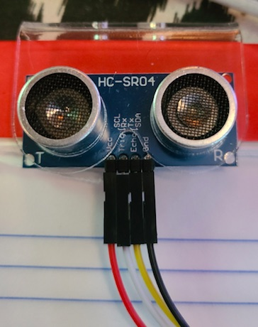
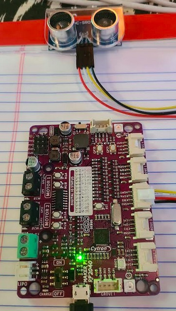

# Ultrasonic Ping Sensor Lab

The Grove sensors on our Maker Pi RP2040 only supply 3.3 volts.  So the standard very popular low cost HC-SR04 will not work, since it requires 5 volts of power.  We have two options.  One is to get a separate 5V power source, but the other is to purchase the new HC-SR04**P** (for Pico?) sensor that will work with our 3.3 volt power on our Grove connector.

Using the Grove 4 connection wire the HC-SP04P sensor with the trigger on GPIO-16 (White cable) and the echo on GPIO-17 (Yellow cable),  VCC (Red cable), and GND (Black cable)



All wired up 



```
# Sample code to test HC-SR04 Ultrasonice Ping Sensor
# Connect GND to any GND pin on the Pico
# Connnect VCC to VBUS or 5 Volt power

from machine import Pin, Timer
import utime

TRIGGER_PIN = 16 # With USB on the top, this pin is the bottom left corner
ECHO_PIN = 17 # One up from bottom left corner

# Init HC-SR04 pins
trigger = Pin(TRIGGER_PIN, Pin.OUT) # send trigger out to sensor
echo = Pin(ECHO_PIN, Pin.IN) # get the delay interval back

def ping():
    trigger.low()
    utime.sleep_us(2) # Wait 2 microseconds low
    trigger.high()
    utime.sleep_us(5) # Stay high for 5 miroseconds
    trigger.low()
    while echo.value() == 0:
        signaloff = utime.ticks_us()
    while echo.value() == 1:
        signalon = utime.ticks_us()
    timepassed = signalon - signaloff
    distance = (timepassed * 0.0343) / 2
    return distance

while True:
    print("Distance:", ping(), "cm")
    utime.sleep(.25)
    
```

More advanced version with sound

```
# Sample code to test HC-SR04 Ultrasonice Ping Sensor
# Connect GND to any GND pin on the Pico
# Connnect VCC to VBUS or 5 Volt power

from machine import Pin, Timer, PWM
import utime

TRIGGER_PIN = 16 # With USB on the top, this pin is the bottom left corner
ECHO_PIN = 17 # One up from bottom left corner

# Init HC-SR04 pins
trigger = Pin(TRIGGER_PIN, Pin.OUT) # send trigger out to sensor
echo = Pin(ECHO_PIN, Pin.IN) # get the delay interval back

BUZZER_PORT = 22
buzzer = PWM(Pin(BUZZER_PORT))

#  Note the non-linear increases in frequency - note that some are louder
tone_freq = [100, 150, 210, 280, 350, 450, 580, 750, 850, 950, 1000]
def playtone(frequency):
    buzzer.duty_u16(1000)
    buzzer.freq(frequency)

def bequiet():
    buzzer.duty_u16(0)

def ping():
    trigger.low()
    utime.sleep_us(2) # Wait 2 microseconds low
    trigger.high()
    utime.sleep_us(5) # Stay high for 5 miroseconds
    trigger.low()
    while echo.value() == 0:
        signaloff = utime.ticks_us()
    while echo.value() == 1:
        signalon = utime.ticks_us()
    timepassed = signalon - signaloff
    distance = (timepassed * 0.0343) / 2
    return distance

while True:
    dist=round(ping())
    print("Distance:", dist, "cm")
    if dist < 20:
        print("Panic")
        playtone(350)
        # Beep faster the closer you get
        utime.sleep(.05/(20/dist))
        bequiet()
    utime.sleep(.1)
    
```


## Link to Sample Ping Lab
This code is very similar to the previous ping lab but with the different GPIO lines used. 

[Link to Standard Ping Lab](../../sensors/03-ping.md)
