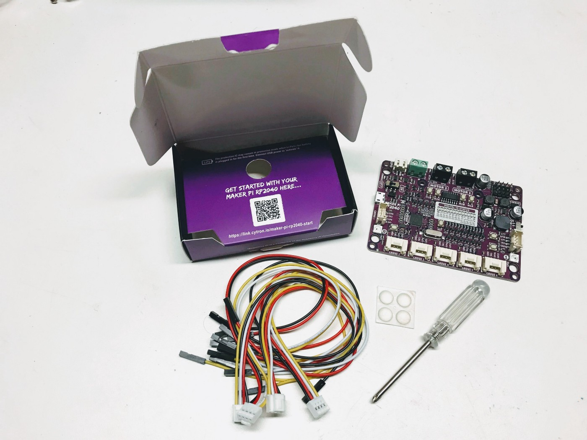
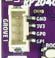
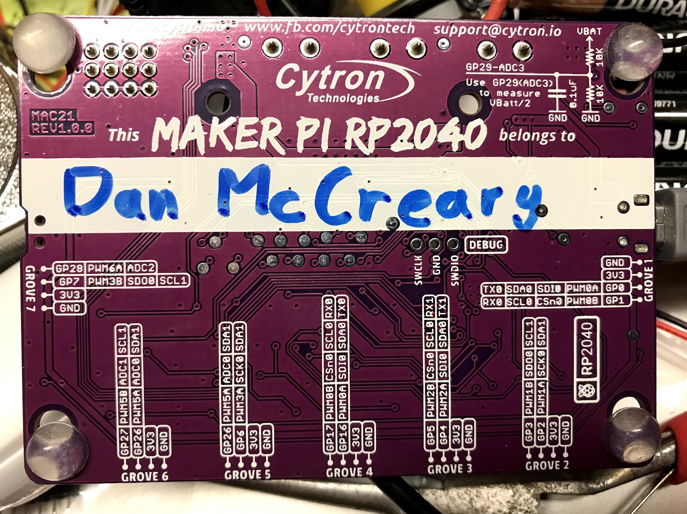

# Maker Pi RP2040 MicroPython Robotics Kit

The Maker Pi PR2040 kit from [Cytron Technologies](https://www.cytron.io/) is a [$9.90 US kit](https://www.cytron.io/p-maker-pi-rp2040-simplifying-robotics-with-raspberry-pi-rp2040) that is designed to simplify learning robotics using the RP2040 chip. It became available in April of 2021, but demand has been very high and it is out-of-stock on many retailers sites.  We can understand this.  The Maker Pi PR2040 is the most powerful robotics board we have ever seen for under $10!

The photo above is our base robot kit.  It includes the Maker Pi RP2040 board mounted on a standards Smart Car chassis.  The image above shows the Time-of-flight distance sensor mounted in the front below the chassis.  Note that the batteries are mounted on the bottom of the robot.

Below is the top view of the Cytron Maker Pi RP2040 robotics board.

## Features
All our robots are built around a RP2040 and a motor driver with a few low-cost sensors and displays.  With the exception of the OLED display, this board packs in a huge number of features for a low cost of $9.90.

* Power status LED (green)
* On/off switch
* 13 blue LEDs to show status on GP pins 0,1,2,3,4,5,6,16,17,26,27 and 28
* 2 WS2812B RGB LEDs connected to GP18
* LiPo Battery Connector
* Micro USB Port (use for powering and programming)
* Reset button
* Boot button
* Momentary press buttons on ports GP20 and GP21
* 2 Motor drivers. Motor A is controlled by GP8 and GP10 and motor B is controlled by GP9 and GP11.
* 4 motor test buttons for testing motors A and B, forward and backward
* 4 red motor status LEDs buttons for displaying motors A and B, forward and backward
* 7 Grove Ports on GPs 1:0,1; 2:2,3; 3:4,5; 4:16,17; 5:6,26; 6:26,27 and 7:7,28
* 4 servo connectors on ports GP12, GP13, GP14 and GP15
* Piezo buzzer on port GP22
* On/Off switch on GP22 which can be used to mute the sound
* Phillips head screwdriver that works on the header pins - really convenient for students!
* 4 [Grove Connectors](https://wiki.seeedstudio.com/Grove_System/)
* Rubber mounting feet
* Pins numbers clearly labeled both on top and bottom of the board
* Large area on bottom of the board for students to write their name

## List of Labs

### Part 1: No Accessories Required Labs

These labs don't need anything except the Maker Pi RP2040 board.

1. [**Blue LED Lab**](02-blue-led-lab.md) - make the blue GPIO status LEDs show cool patterns
2. [**NeoPixel Lab**](03-neopixel-lab.md) - make the two NeoPixel each display many colors
3. [**Button Lab**](04-button-lab.md) - make the two buttons change the state of system
4. [**Sound Lab**](05-sound-lab.md) - make the Piezoelectric Buzzer create sounds
5. [**Up Down Mode Lab**](06-up-down-lab.md) - make the buttons change the LEDs, NeoPixels and Sound

### Part 2: Motor and Servo Labs

These labs require additional parts such as DC hobby motors and servos

1. [**Motor Connection Lab**](../maker-pi-rp2040-robot/07-motor-connection-lab.md) - make two motors turn forward and in reverse
2. [**Up/Down Motor Speed Lab**](../maker-pi-rp2040-robot/06-up-down-motor-lab.md) - change the speed as you change the mode
3. [**Servo Lab**](../maker-pi-rp2040-robot/08-servo-lab.md) - control the direction of a 108% servo motor.  Calibrate the end angles and sweep the direction back and forth.

### Part 3: Sensor Labs

There are literally hundreds of sensors that have Grove connectors on them.  In addition, we can purchase Grove connectors for as low as [30 cents each](https://www.cytron.io/p-grove-4-pin-buckled-20cm-cable?search=Grove&description=1).  Any other sensors with male pins can be easily connected with these [38 cent connectors with female Dupont jumper connectors](https://www.cytron.io/p-grove-4-pin-buckled-to-female-cable?search=Grove&description=1).  Classrooms with a large collection of these sensors can allow students to try new sensors and outputs without needing a breadboard or soldering.  We will focus initially on two sensors we will use for our collision avoidance robot.  We prefer the Time-of-Flight sensor because it uses a standard I2C interface and thus could share the I2C bus with other devices.

1. [**Time of Flight Distance Sensor Lab**](../maker-pi-rp2040-robot/10-time-of-flight-lab.md) - measure the distance to an object
2. [**Ultrasonic Ping Distance Sensor**](../maker-pi-rp2040-robot/11-ping-lab.md) - the classic low-cost ultrasonic distance sensor but now it works on a 3.3 volt power!  (TBD)
3. [**Time of Flight Sound Lab**](../maker-pi-rp2040-robot/12-time-of-flight-sound-lab.md) - sound pitch changes with distance

### Part 4: Collision Avoidance Robot

1. [**Collision Avoidance Robot**](20-collision-avoidance-robot.md) - this lab joins our motor and sensor labs with a SmartCar chassis to create a robot that avoids collisions.
2. Collision Robot with Modes - TBD
3. Adjustable Collision Avoidance - the adjusta bot! TBD
4. Adding a display

## Basis for a Low-Cost Robot Kit

When this kit is combined with a standard [2 Wheel Drive Smart Car Chassis](https://www.cytron.io/p-2wd-smart-robot-car-chassis) and a [distance sensor](https://www.coderdojotc.org/micropython/sensors/07-VL53L0X_GY/) it becomes a great low-cost way of getting started with Python and robots.

## Clearly Labeled Pin Numbers

One of the biggest disadvantages of the Raspberry Pi Pico is the fact that pin labels are NOT visible when it is mounted on a breadboard.  We have to take the Pico out of the breadboard to read the pin numbers on the bottom of the board.  A much better design would be to follow the best practices and put the labels on the top of the board where they are visible.  This is clearly done on the Maker Pi RP2040 board!

Note the pin labels, GND, 3.3V, GP0 and GP1 are clearly printed on the top of the board.

Note the circuit in the upper right corner displays how you can use the analog input port to read the battery level of the robot.

## Removing the Default CircuitPython

Cytron Technologies has a wonderful [YouTube videos](https://www.youtube.com/watch?v=mn1nqgEkufA) on how to program the Maker Pi RP2040 using MicroPython.  Unfortunately, this board does NOT come with our standard MicroPython loaded! :-O  It uses the non-standard Adafruit CircuitPython that is incompatible with most MicroPython programs being used today.  This is a sad state of affairs that confuses our students and makes it difficult to share code and libraries for MicroPython.  According to Google trends, over the last 12 months for worldwide searches, [MicroPython has almost five time the interest of CircuitPython](https://trends.google.com/trends/explore?q=micropython,circuitpython).  Preloading the board with CircuitPython sends a very confusing message to the marketplace.

## Flash Nuke
I want to make sure that my RP2040 was starting out with a clean image.  I downloaded the [flash_nuke.uf2](https://www.raspberrypi.org/documentation/pico/getting-started/static/6f6f31460c258138bd33cc96ddd76b91/flash_nuke.uf2) file to remove the default CircuitPython runtime and all the related files.

Note that the board **must** be fully powered down after this load for it to work.  I had 4 AA batteries connected to the VIN screw headers, so it was not resetting correctly and the reset was not working until I disconnected the batteries.

The latests MicroPython runtimes are [here](https://micropython.org/download/rp2-pico/)

## Easy Motor Testing Buttons

One of the things I love about this board is how incredibly easy it is for students to test their motors.  The board provides four very convenient motor test buttons right on the board.  By pressing each one you can make both motors go forward and backwards.  This is a great way for students to learn about how we can generate PWM signals to simulate these four buttons.  Whoever design this board clearly had their students in mind!

## References
* [Link on Box](https://link.cytron.io/maker-pi-rp2040-start)
* [GitHub Link](https://github.com/CytronTechnologies/MAKER-PI-RP2040)
* [Cytron Maker Pi RP2040 Product Page](https://www.cytron.io/p-maker-pi-rp2040-simplifying-robotics-with-raspberry-pi-rp2040)
* [Cytron Maker Pi RP2040 Datasheet on Google Docs](https://docs.google.com/document/d/1DJASwxgbattM37V4AIlJVR4pxukq0up25LppA8-z_AY/edit)
* [Digi-Key Cytron Maker Pi RP2040 reseller](https://www.digikey.com/en/products/detail/cytron-technologies-sdn-bhd/MAKER-PI-RP2040/14557836)
* [Amazon Listing](https://www.amazon.com/dp/B096DFH22X) - no availability as of Aug. 15th 2021
* [Adafruit Cytron Maker Pi RP2040 reseller](https://www.adafruit.com/product/5129) - out of stock as of Aug. 15th 2021
* [1300 mah battery](https://www.cytron.io/p-lipo-rechargeable-battery-3.7v-1300mah)
* [Ultrasonic Sensor Video on YouTube](https://www.youtube.com/watch?v=mn1nqgEkufA)
* [Circuit Schematic](https://drive.google.com/file/d/1Zp8GYO8x7ThObB1G8RIZx2YdqrXtdUc0/view)