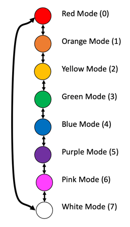

# NeoPixel Button Lab

## Review of Button Basics

[Button Basics](../../basics/03-button.md)

## Working with Two Buttons

## Changing Color With Buttons

## Using Modes

Our LED kit can run a single "main" loop forever.  But we often want to have the main loop run a different subprogram.  Each subprogram can be triggered by pressing a button.  The button will update a variable and the main loop will use this variable to redirect the main to the appropriate function.

The ```mode``` variable is traditionally used to store the current subprogram being run.  You are not limited to a single mode.  You can also have modes within modes.




1. Using a buttons to advance a mode
2. Using a two buttons to move to the next and previous mode
3. Using two modes - one mode or each button


## Changing Patterns With Buttons

## Changing Color and Pattern