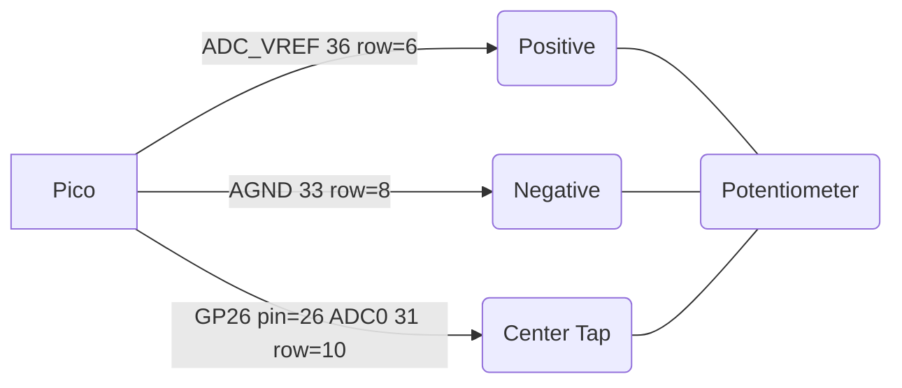

```mermaid
graph LR
    p[Pico] -->|ADC_VREF 36 row=6| pos(Positive)
    p[Pico] -->|AGND 33 row=8| neg(Negative)
    p[Pico] -->|GP26 pin=26 ADC0 31 row=10| tap(Center Tap)
    pos(Positive) --- pot(Potentiometer)
    neg(Negative) --- pot(Potentiometer)
    tap(Center Tap) --- pot(Potentiometer)
```

```mermaid
graph LR
MyApp --> DB(<font color=white>fa:fa-database MySQL)
style DB fill:#00758f
```