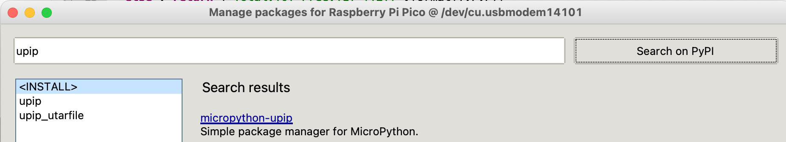

# MicroPython PIP (UPIP)

MicroPython also has a package manager that can be run directly on the microcontoller.

## Install UPIP From Thonny Package Manager

## Install A Package

Connecting to WiFi Network Name: anndan-2.4
Waiting for connection...
1.2.3.4.Connect Time: 4641
Ping the following address: 10.0.0.49
Installing to: /lib/
Warning: micropython.org SSL certificate is not validated
Installing micropython-pystone_lowmem 3.4.2.post4 from https://micropython.org/pi/pystone_lowmem/pystone_lowmem-3.4.2.post4.tar.gz