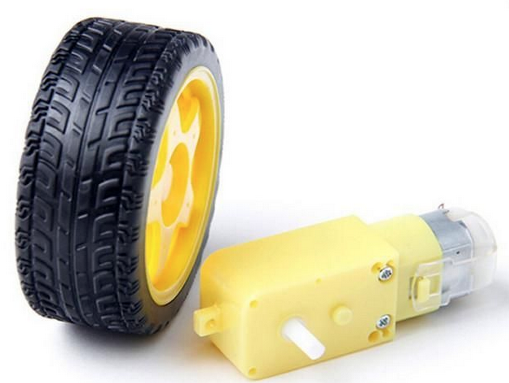

# Using MicroPython to Control Motors and Servos

Controlling motors are one of the funnest ways to learn how to program!  They give us quick hand-on feedback on what are programs are doing.  Motors are used in almost all our robot project.  Robots are used in many STEM courses and coding clubs around the world.  Programs like the AI Racing League allow students to learn topics like Machine Learning, Computer Vision and AI.  These programs all depend on our understanding of how motors work and how to control them.

## Motor Types
There are three types of motors we will learn how to control:

1. DC Motors
2. Servos
3. Stepper Motors

## Outline of Labs

## Lab 1: Using and Transistor to Control a Motor
In this lab we will use MicroPython to turn a motor on and off.  We will use the digital output from the Raspberry Pi Pico to control a transistor as a switch to control the current to a motor.  We will also learn how to use a diode to to protect the transistor from flyback current.

## Theory: What is an H-Bridge Circuit?
This lab shows a sample circuit with four switches arranged in the shape of the letter "H" with the motor at the center of the letter.  By closing switches in opposite corners we can make the motor reverse direction.

## Lab 2: Controlling a Motor Speed with the L293 H-Bridge Chip
In this lab we will use a PWM signal to control the speed of a motor.

## Lab 3: Changing Motor Direction

In this lab we will make a motor go both forward and backward and change the speed.