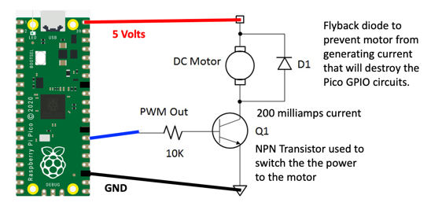

# Using an Transistor to Control a Motor

## Power Requirements for Motors

Motors need about 200 milliamps to work.  But a microcontroller like the Raspberry Pi Pico only can switch about 18 milliamps.  So we need a way to control more power.

The Pico has 26 general purpose input and output pins.  However, each pin's power is designed to digitally communicate with other devices and has a limited current capacity of around 17 milliamps according to the [Raspberry Pi Pico Datasheet Table 5](https://github.com/raspberrypi/documentation/blob/master/hardware/computemodule/datasheets/rpi_DATA_CM_2p0.pdf).  The solution is to either use the digital output signal to turn on and off a switch such as a transistor of to use a motor driver chip such as an L293D chip.

## Basic Transistor Circuit

1. Transistor NPN 2222A
2. Diode: 1N1448
3. Motor: 3-6 volt hobby motor



## PWM Control

### PWM Frequency
Set the frequency to 50Hz (one cycle per 20ms) and the duty value to between 51 (51/1023 * 20ms = 1ms) and 102 (102/1023 * 20ms = 2ms)

## Sample Coder

```py
import machine

# set the 7th from the bottom on right as our motor pin
motor_pin = machine.Pin(21, machine.Pin.OUT)
# allocate a PWM object for controlling the motor speed
motor_pwm = machine.PWM(motor_pin)
motor_pwm.freq(50) # 50 hertz
motor_pwm.duty(51)
```

## References

1. [Sparkfun Motor Lab from SIK Kit](https://learn.sparkfun.com/tutorials/sik-experiment-guide-for-arduino---v32/experiment-12-driving-a-motor)
2. [Nick Zoic MicroPython Motor Control Tutorial](http://mpy-tut.zoic.org/tut/motors.html)

