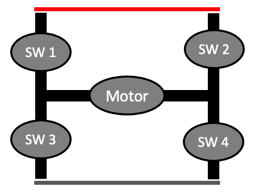
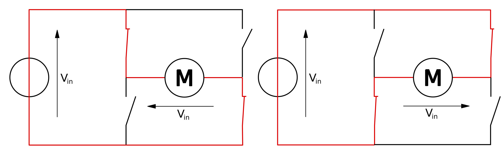

# H-Bridge Circuits

H-Bridge circuits are use to drive a motor both forward and backward.  The circuit is called an "H-Bridge" because the arrangement of the switches around a motor form the letter "H".

## H-Bridge Circuit Operation

If you connect a 5 volt power supply to a motor you will turn the motor in a specific direction such as clockwise.  If you reverse the connections to the motor, the motor will turn the opposite direction such as counter-clockwise.

In order to turn on the motor, switches 1 and 4 must be closed to allow current to flow through the motor.  Switches 2 and 3 must be turned off.

To reverse the motor direction you must open switches 1 and 4 and close switches 2 and three in the upper right and lower left portion of the diagram.

## References

1. [Wikipedia Page on H-Bridge Circuits](https://en.wikipedia.org/wiki/H-bridge)
