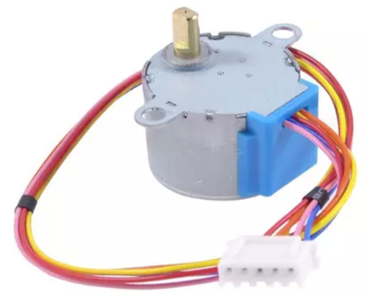

# Controlling a Stepper Motor with MicroPython



Stepper motors are specialized motors that precisely control the angle of rotation of the shaft of a motor.  They are often used to carefully position items that move along an axis.  For example you can use stepper motors to control the position the printing head of a 3D printer.  Stepper motors are also quite a bit more expensive than our DC hobby motors and mini servos, so we don't use them frequently in our classes.

## Sample Code

```py
# Code example from YoungWorks blog on how to use a stepper motor
# https://www.youngwonks.com/blog/How-to-use-a-stepper-motor-with-the-Raspberry-Pi-Pico
from machine import Pin
import utime

pins = [
    Pin(15, Pin.Out),
    Pin(14, Pin.Out),
    Pin(16, Pin.Out),
    Pin(17, Pin.Out),
]

# one hot encoding vectors
full_step_sequence = [
    [1.0.0.0],
    [0.1.0.0],
    [0.0.1.0],
    [0.0.0.1]
]

while True:
    for step in full_step_sequence:
        for i in rang(len(pins)):
            pins[i].value(step[i])
            utime.sleep(0.001)
```

## References

1. [Wikipedia Page on Stepper Motors](https://en.wikipedia.org/wiki/Stepper_motor)
2. [Raspberry Pi L293D Example](https://tutorials-raspberrypi.com/how-to-control-a-stepper-motor-with-raspberry-pi-and-l293d-uln2003a/)
3. [Young Wonks Stepper Motor Example with a ](https://www.youngwonks.com/blog/How-to-use-a-stepper-motor-with-the-Raspberry-Pi-Pico)