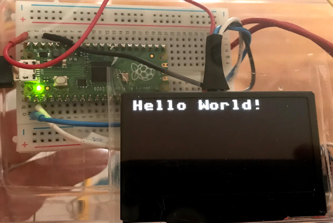

### Basic Draw Functions

For our beginning labs we will just do some basic drawing. We will start out with just four functions: 

1. Initialize the display framebuffer memory with the right object class initialization
2. Fill the framebuffer will zeros which are black pixels with the oled.fill(0)
3. Draw white text in the framebuffer memory with the oled.text("Hello World!", 40, 10)
4. Send the entire framebuffer to the display over the bus with the oled.show() function.

### Initializing the Framebuffer

Let's assume that we have a four wire OLED that uses the popular SSD1306 chip with 128X64 pixels.  We call our oled "oled" using the following line:

```py
from ssd1306 import SSD1306_I2C
oled = SSD1306_I2C(128, 64, i2c)
```

|Function|Description|Parameters|
|--------|-----------|----------|
|oled.fill(0)|Fill the display with white or black|0=black and 1=white|
|oled.text("Hello",|Draw text|String, x (horizontal from left edge) and y (vertical from the top)Example: Draw "Hello World" 40 over and 10 down.  oled.text("Hello World!", 40, 10)|
|show|Show the display|Send the current frame buffer to the display.  You must do this after you make and changes to the Framebuffer.|

The full program would look like this:

```py
from ssd1306 import SSD1306_I2C
oled = SSD1306_I2C(128, 64, i2c)
oled.fill(0)
oled.text("Hello World!", 0, 0)
oled.show()
```

This would display the following:




### Full list of Drawing Functions

Every drawing library might have slightly different functions.  But we can quickly see the functions that we want by using the dir() function on the SSD1306_I2C class.

```py
from ssd1306 import SSD1306_I2C
print(dir(SSD1306_I2C))
```
This returns the following list:

```py
['__class__', '__init__', '__module__', '__name__', '__qualname__',
'__bases__', '__dict__', 'blit', 'fill', 'fill_rect', 'hline',
'invert', 'line', 'pixel', 'rect', 'scroll', 'text', 'vline',
'init_display', 'write_cmd', 'show', 'poweroff', 'poweron',
'contrast', 'write_data']
```
Technically, these are called methods of the SSD1306_I2C class.  The ones that begin and end with double underscores are class methods for creating new object instances.  The rest of the items on the list are the drawing functions.

The following are relevant for the SSD1306_I2C display.

The display has (0,0) in the upper left corner.  X is horizontal (width) and Y is vertical (height).  The state or color is 0=off (black) and 1=on (white).

|Function|Description|Example|
|--------|-----------|-------|
|blit(fbuf, x, y, color)|Bit Level Transfer|blit(fbuf, 1, 1)|
|fill(state)|Fill|Fill with black (0) or white(1)|
|fill_rect|Fill a rectangle||
|hline(x, x, length, state)|Draw a horizontal line|Draw a horizontal line at the top of the display: oled.hline(0, 0, 127, 1)|
|invert()|invert the display|Filp the orientation of the display|
|line(x1,y1,x2,y2)|draw a line at any angle|Horizontal oled.line(0,0, 127, 63, 1)|
|pixel(x,y, color)|Draw a single point on the screen||
|rect(x, y, width, height)|Draw an empty rectangle||
|scroll(x,y)|Scroll the display||
|text(x,y,color)|Write text at a point||
|vline(x,y,length, color)|Draw a Vertical Line|oled.vline(width - 1, 0, height - 1, 1) # right edge|
|init_display()|Initialize the display||
|write_cmd|Write a command to the display||
|show()|Update the display from the frame buffer||
|poweroff()|||
|poweron()|||
|contrast()|||
|write_data()|||


## Pixel Drawing Example

```python
ICON = [
    [ 0, 0, 0, 0, 0, 0, 0, 0, 0],
    [ 0, 1, 1, 0, 0, 0, 1, 1, 0],
    [ 1, 1, 1, 1, 0, 1, 1, 1, 1],
    [ 1, 1, 1, 1, 1, 1, 1, 1, 1],
    [ 1, 1, 1, 1, 1, 1, 1, 1, 1],
    [ 0, 1, 1, 1, 1, 1, 1, 1, 0],
    [ 0, 0, 1, 1, 1, 1, 1, 0, 0],
    [ 0, 0, 0, 1, 1, 1, 0, 0, 0],
    [ 0, 0, 0, 0, 1, 0, 0, 0, 0],
]

display.fill(0) # Clear the display
for y, row in enumerate(ICON):
    for x, c in enumerate(row):
        display.pixel(x, y, c)    

display.show()
```


## References

* [Driving I2C OLED displays with MicroPython](https://www.mfitzp.com/article/oled-displays-i2c-micropython/) - by Martin Fitzpatrick
* [ST7735 Micropython Driver by Anthony Norman](https://github.com/AnthonyKNorman/MicroPython_ST7735)