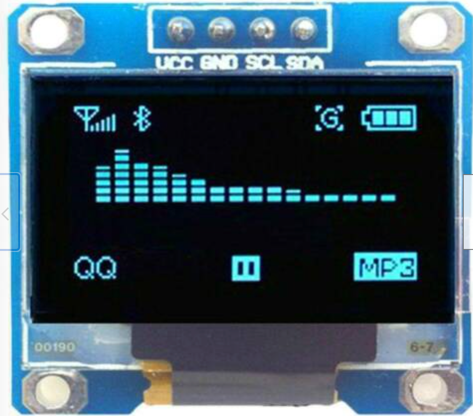
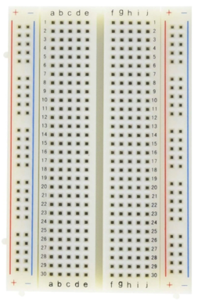
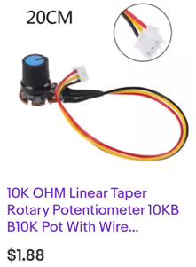

# Pong
Using a low-cost OLED device you can write a pong game.  If you use a small 128X64 OLED the price can be around $12.

## Part list

|Part Name|Price|Link|Description|
|---------|-----|----|-----------|
|Raspberry Pi Pico|$4|[Microcenter](https://www.microcenter.com/search/search_results.aspx?N=&cat=&Ntt=raspberry+pi+pico&searchButton=search)|With 264K RAM it has plenty of room for storing the framebuffer|
|1/2 Size Solderless Breadboard|$2|link|400 tie breadboard|Used to mount the pico|
|128X64 OLED|$5|[eBay](https://www.ebay.com/itm/0-96-OLED-LCD-Display-Module-IIC-I2C-Interface-128x64-For-SSD1306-Prof/373470677081)|You can also get larger 2.42" displays for around $20|
|2 10K Potentiometers|$1.5 each|[eBay](https://www.ebay.com/itm/10K-OHM-Linear-Taper-Rotary-Potentiometer-10KB-B10K-Pot-With-Wire-Portable-H/303636919492)|You can purchase these in QTY 10 for less.  Use the part number B10K to narrow your search.|
|Clear Plastic Box|$4|[The Container Store](https://www.containerstore.com/s/clear-stackable-rectangle-containers-with-white-lids)|Shallow Narrow Stackable Rectangle Clear with Lids 8-1/4" x 3-1/2" x 1-7/8" h.  The link is to the white lids.|


Raspberry Pi Pico for $4.



OLED with I2C Interface.  Note the pins are VCC, GND, SCL (clock), SDA (data).



1/2 size 400 connector solderless breadboard



10K potentiometer with pre-soldered connectors.  You will need two of these. You can use a male-to-male header to connect it to the breadboard.

## Connections

1. Connect the GND of the OLED to GND of the Pico
2. Connect the VCC of the OLED to 3V3 OUT (physical pin 36)
3. Connect the SDA (data) of the OLED to the Pico GP0 (physical pin 1 on the top left with USB up)
4. Connect the SCL (clock) of the OLED to GP1 (physical pin 2)
5. Connect the center tap of both potentiometers to ADC0 (GP26 - pin 31) and ADC1 (GP27 - pin 32)
6. Connect the outer connectors of the potentiometers to VCC and GND

## Getting the Right Python Libraries

To run this program, you will need a MicroPython display driver.  Our display in this example is the popular SSD1306 driver chip.  Your OLED might have a slightly different driver type.

Here is the line that must be customized for your display:

```
from ssd1306 import SSD1306_I2C
```

## Testing the OLED

This test will verify that your OLED connections are correct.

```py
from machine import Pin, I2C
from ssd1306 import SSD1306_I2C
WIDTH  = 128
HEIGHT = 64
sda=machine.Pin(0)
scl=machine.Pin(1)
i2c=machine.I2C(0,sda=sda, scl=scl)
oled = SSD1306_I2C(WIDTH, HEIGHT, i2c)
oled.fill(0)
oled.text("CoderDojo Rocks",0,0)
oled.show()
```

## Drawing the Border

```
def border(WIDTH, HEIGHT):
    oled.rect(0, 0, WIDTH, HEIGHT, 1)
```

## Full Program

```python
# Pong game on Raspberry Pi Pico with a OLED and two Potentimeters
from machine import Pin, PWM, SPI
import ssd1306
from utime import sleep
import random # random direction for new ball

spi_sck=machine.Pin(2)
spi_tx=machine.Pin(3)
spi=machine.SPI(0,baudrate=100000,sck=spi_sck, mosi=spi_tx)
CS = machine.Pin(1)
DC = machine.Pin(4)
RES = machine.Pin(5)
oled = ssd1306.SSD1306_SPI(128, 64, spi, DC, RES, CS)
# connect the center tops of the potentiometers to ADC0 and ADC1
pot_pin_1 = machine.ADC(26)
pot_pin_2 = machine.ADC(26) # make them the same for testing

# lower right corner with USB connector on top
SPEAKER_PIN = 16
# create a Pulse Width Modulation Object on this pin
speaker = PWM(Pin(SPEAKER_PIN))

# globals variables
# static variables are constants are uppercase variable names
WIDTH = 128
HALF_WIDTH = int(WIDTH / 2)
HEIGHT = 64
HALF_HEIGHT = HEIGHT
BALL_SIZE = 3 # 2X2 pixels
PAD_WIDTH = 2
PAD_HEIGHT = 8
HALF_PAD_WIDTH = int(PAD_WIDTH / 2)
HALF_PAD_HEIGHT = int(PAD_HEIGHT / 2)
POT_MIN = 3000
POT_MAX = 65534
MAX_ADC_VALUE = 65534 # Maximum value from the Analog to Digital Converter is 2^16 - 1
# dynamic global variables use lowercase
paddle1_vel = 0
paddle2_vel = 0
l_score = 0
r_score = 0
# continiuous update of the paddle and ball
# play_startup_sound()
# start with the ball in the center
ball_x = int(WIDTH / 2)
ball_y = int(HEIGHT / 2)
# set the initial directinon to down to the right
ball_x_dir = 1
ball_y_dir = 1

def play_startup_sound():
    speaker.duty_u16(1000)
    speaker.freq(600)
    sleep(.25)
    speaker.freq(800)
    sleep(.25)
    speaker.freq(1200)
    sleep(.25)
    speaker.duty_u16(0)

def play_bounce_sound():
    speaker.duty_u16(1000)
    speaker.freq(900)
    sleep(.25)
    speaker.duty_u16(0)

def play_score_sound():
    speaker.duty_u16(1000)
    speaker.freq(600)
    sleep(.25)
    speaker.freq(800)
    sleep(.25)
    speaker.duty_u16(0)
    
# note that OLEDs have problems with screen burn it - don't leave this on too long!
def border(WIDTH, HEIGHT):
    oled.rect(0, 0, WIDTH, HEIGHT, 1)


# Takes an input number vale and a range between high-and-low and returns it scaled to the new range
# This is similar to the Arduino map() function
def valmap(value, istart, istop, ostart, ostop):
  return int(ostart + (ostop - ostart) * ((value - istart) / (istop - istart)))

# draw a vertical bar
def draw_paddle(paddle_no, paddle_center):
    if paddle_no == 1:
         x = 0
    else:
         x = WIDTH - 2
    y = paddle_center - HALF_PAD_HEIGHT
    oled.fill_rect(x,  y, PAD_WIDTH, PAD_HEIGHT, 1) # fill with 1s

def draw_ball():
    oled.fill_rect(ball_x, ball_y, BALL_SIZE, BALL_SIZE, 1) # square balls for now

# The main event loop
while True:
    oled.fill(0) # clear screen
    oled.vline(int(WIDTH / 2), 0, HEIGHT,  1)
    # border(WIDTH, HEIGHT)
    # read both the pot values
    pot_val_1 = pot_pin_1.read_u16()
    pot_val_2 = pot_pin_1.read_u16()
    # print(pot_val_1)
    
    # scale the values from the max value of the input is a 2^16 or 65536 to 0 to HEIGHT - PAD_HEIGHT
    # ideally, it should range from 5 to 58
    pot_val_1 = valmap(pot_val_1, POT_MIN, POT_MAX, HALF_PAD_HEIGHT, HEIGHT - HALF_PAD_HEIGHT - 2)
    pot_val_2 = valmap(pot_val_2, POT_MIN, POT_MAX, HALF_PAD_HEIGHT, HEIGHT - HALF_PAD_HEIGHT - 2)
    
    # print(pot_val, pot_scaled)
    draw_paddle(1, pot_val_1 + HALF_PAD_HEIGHT)
    draw_paddle(2, pot_val_2 + HALF_PAD_HEIGHT)
    draw_ball()
    
    #update ball position with the current directions
    ball_x = ball_x + ball_x_dir
    ball_y = ball_y + ball_y_dir

    # update the ball direction if we are at the top or bottom edge
    if ball_y < 0:
        ball_y_dir = 1
        #play_bounce_sound()
    if ball_y > HEIGHT - 3:
        ball_y_dir = -1
        #play_bounce_sound()
    
    # if it hits the paddle bounce else score
    if ball_x < 1:
        top_paddle = pot_val_1 - HALF_PAD_HEIGHT
        bottom_paddle = pot_val_1 + HALF_PAD_HEIGHT
        if ball_y > top_paddle and ball_y < bottom_paddle:
            # we have a hit
            ball_x_dir = 1
            ball_x = 2
            play_bounce_sound()
            print('paddle hit on left edge', pot_val_1, top_paddle, bottom_paddle)
        else:
            # we have a score for the right player
            play_score_sound()
            r_score += 1
            ball_x = int(WIDTH / 2)
            ball_y = int(HEIGHT / 2)
            ball_x_dir = random.randint(-1, 2)
            if ball_x_dir == 0:
                ball_x_dir = 1
            ball_y_dir = random.randint(-1, 2)
            print('score on left edge', pot_val_1, top_paddle, bottom_paddle)
            sleep(.25)
            
    if ball_x > WIDTH - 3:
        ball_x = WIDTH - 4
        top_paddle = pot_val_2 - HALF_PAD_HEIGHT
        bottom_paddle = pot_val_2 + HALF_PAD_HEIGHT
        if ball_y > top_paddle and ball_y < bottom_paddle:
            ball_x_dir = -1
            print('bounce on right paddle', pot_val_1, top_paddle, bottom_paddle)
        else:
            l_score += 1
            play_score_sound()
            ball_x = int(WIDTH / 2)
            ball_y = int(HEIGHT / 2)
            ball_x_dir = random.randint(-1, 2)
            if ball_x_dir == 0:
                ball_x_dir = 1
            ball_y_dir = random.randint(-1, 2)
            play_bounce_sound()
            print('score on right edge', pot_val_1, top_paddle, bottom_paddle)
            sleep(.25)

    oled.text(str(l_score), HALF_WIDTH - 20, 5, 1)
 
    oled.text(str(r_score), HALF_WIDTH + 5, 5, 1)
      
    oled.show()
```

[YouTube Video](https://www.youtube.com/watch?v=W6Yr9gv2dTQ)