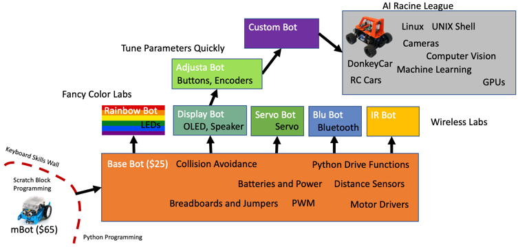

# Introduction to CoderDojo Pico Robots

Robots are the most powerful learning machines in our CoderDojo project collections.  The allow our students to control motion with their own programs.  Not only are they incredibly fun for our students, they enable them to quickly proceed to our advanced AI Racing League projects.

## Robot Journey Map

This section of the course takes you on a tour of our base $25 collision avoidance robots.  It then builds on this robot by adding an OLED display, programming controls and servos.  Here is a Journey Map of these lessons:

Note that the $25 price assumes you purchase low-cost parts from suppliers like eBay.  You can lower the cost per robot by purchasing the parts in higher quantities for classroom use.  You can also purchase older Arduino robot kits and upgrade the processors to use the Raspberry Pi Pico.

1. **[Base Bot](02-base-bot.md)** - This is the foundational robot that the other projects are built on.  The base includes a standard Smart Car chassis, two DC hobby motors, a battery pack and wheels.  On top of the chassis we add a breadboard, jumpers, a motor controller, a distance sensor, and our $4 Raspberry Pi microcontroller.

2. **[Rainbow Bot](03-rainbow-bot.md)** This takes our base robot and adds a low-cost LED strip so that students can change the color of the LED based on what the robot is sensing and doing.  For example when the robot is turning right the LEDs can turn red.

3. **[IR Sensor Bot](03-ir-sensor-bot.md)** This takes our base robot and adds a low-cost LED strip so that students can change the color of the LED based on what the robot is sensing and doing.  For example when the robot is turning right the LEDs can turn red.

4. **[Face Bot](04-face-bot.md)** - We extend the Base Bot by adding a $4 128x64 OLED display.  This allows students to see the values of the distance sensor and to hear a sound when a key event occurs.

5. **[Adjustable Parameter Bot](05-adjusta-bot.md)** - We extend the face-bot to add some buttons and knobs to allow our users to change the collision avoidance parameters such as forward speed and turning threshold distance.

## Parts

Our beginning Base Bot

### Chassis

SmartCar Chassis

### Sensors

* Ping Ultrasonic Distance Sensor
* IR sensors

### Motor Controllers

