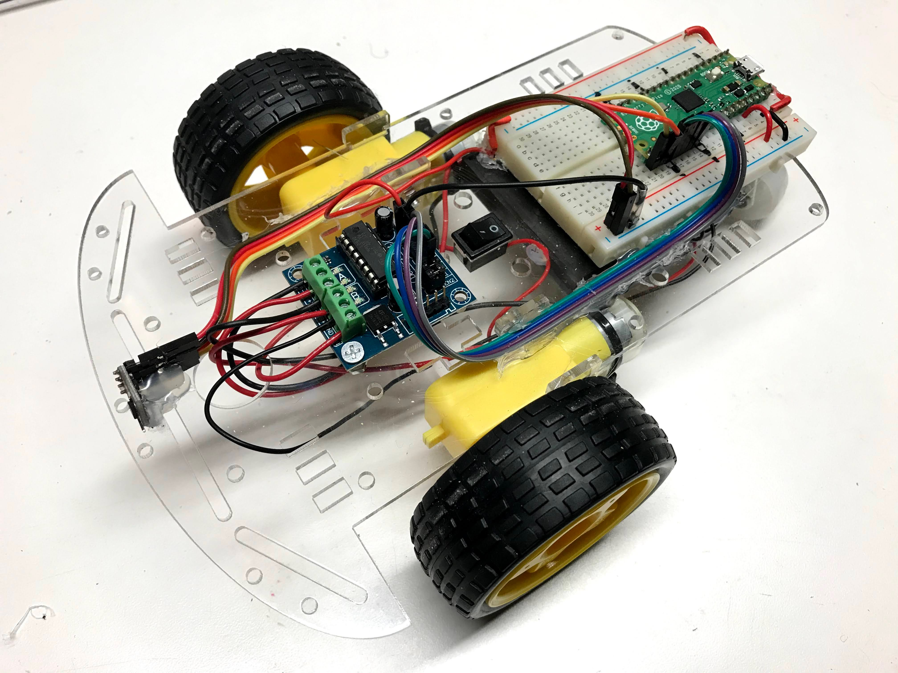
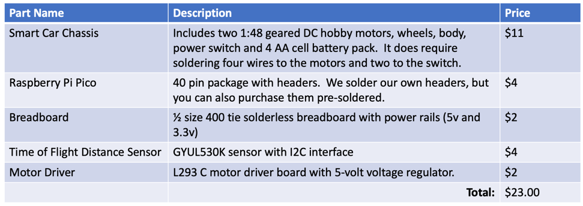
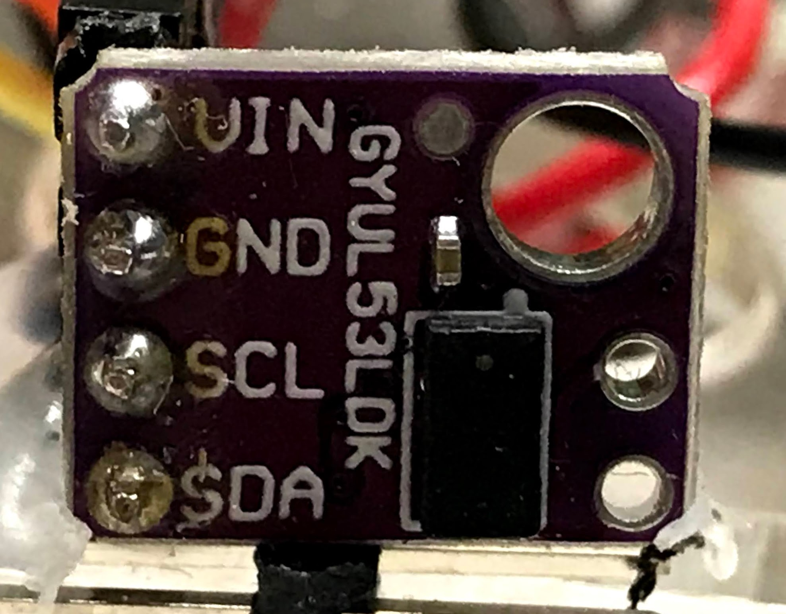

# Raspberry Pi Pico Micropython Base Robot



This lesson describes out base robot kit in the CoderDojo Twin Cities coding club.  This is a new robot that in programmed entirely in python to be consistent with our [Python Courses](https://www.coderdojotc.org/python/).

## Base Robot Design

Our goal is to build a robotics platform for teaching computational thinking.  Here are our main design goals:

1. Low cost (under $25) so that most students can afford their own robot
2. Open platform to make it easy to upgrade (sustainably)
3. Interchangeable parts
4. Minimal amount of soldering

## Video

Here is a video of the collision avoidance robot in action:

<iframe width="560" height="315" src="https://www.youtube.com/embed/0d3tF1oXu90" title="YouTube video player" frameborder="0" allow="accelerometer; autoplay; clipboard-write; encrypted-media; gyroscope; picture-in-picture" allowfullscreen></iframe>

[YouTube Video](https://youtu.be/0d3tF1oXu90)

Note that the **forward-speed** and **distance-before-you-turn** can be adjusted.  You can see I didn't quite get the distance right and the robot bumps into some of the barriers.

## Hardware Description

Here is a summary of some of the parts we use in this robot and their approximate prices as of June 2021.  Some parts come from China so you might need to wait 2-3 weeks for them to arrive.



Here is a Google sheet with these parts:

[Detailed Parts List Google Sheet](https://docs.google.com/spreadsheets/d/1I6PwM470JuRHZVHkg1uiMuoXlsIpyv0Ak2ayZP8VWFc/edit?usp=sharing)

### Motor Driver


### Time-of-Flight Distance Sensor



## Software

All software is written in Python.  You must include the driver for the 

### Distance Sensor

We are using the VL53L0X time-of-flight distance sensor.  This works on an I2C bus.  After you have hooked up the Power (VCC to the 3.3 rail and GND) you must hook up the I2C data and clock.

```py
sda=machine.Pin(16) # Lower right corner of the Pico with the USB on top
scl=machine.Pin(17) # One up from the lower right corner of the Pico
i2c=machine.I2C(0, sda=sda, scl=scl)
```

### Testing the Senser Connections with the I2C Scanner

```py
import machine
sda=machine.Pin(16) # Lower right corner of the Pico with the USB on top
scl=machine.Pin(17) # One up from the lower right corner of the Pico
i2c=machine.I2C(0, sda=sda, scl=scl)
print("Device found at decimal", i2c.scan())
```

You should see a decimal number returned.  By default the I2C address is 41 (decimal) or x29 (hexadecimal).

### Download the VL53L0X Driver

You will need to add a VL53L0X driver file to the file system on the pico.

We have a copy here: [https://raw.githubusercontent.com/CoderDojoTC/micropython/main/src/drivers/VL53L0X.py](https://raw.githubusercontent.com/CoderDojoTC/micropython/main/src/drivers/VL53L0X.py)

### Time-of-Flight Sensor Test

Once the driver file is loaded we are ready to test the time-of-flight distance sensor.

```py
import time
from machine import Pin
from machine import I2C
import VL53L0X

sda=machine.Pin(16) # row one on our standard Pico breadboard
scl=machine.Pin(17) # row two on our standard Pico breadboard
i2c=machine.I2C(0, sda=sda, scl=scl)

# Create a VL53L0X object
tof = VL53L0X.VL53L0X(i2c)
tof.start() # startup the sensor
while True:
# Start ranging
    dist = tof.read()
    print(dist)
    time.sleep(.1)

```

When you run this program a sequence of integers will appear in the console.  The numbers usually will range from around 30 if there is an object directly in front of the sensor to a number around 1,300 for a object that is about 1.3 meters away from the sensor.  There is a 1/10th of a second pause between each measurement.  This can be changed in the last line of the program.

### Motor Drive Test

After we have the four wires connected to the motor driver, we need to make sure we get the right wires to the right motors and motor directions.  This program will help you debug this.

```py
from machine import Pin, PWM
import time # sleep

POWER_LEVEL = 65025
# lower right pins with USB on top
RIGHT_FORWARD_PIN = 21
RIGHT_REVERSE_PIN = 20
LEFT_FORWARD_PIN = 18
LEFT_REVERSE_PIN = 19

right_forward = PWM(Pin(RIGHT_FORWARD_PIN))
right_reverse = PWM(Pin(RIGHT_REVERSE_PIN))
left_forward = PWM(Pin(LEFT_FORWARD_PIN))
left_reverse = PWM(Pin(LEFT_REVERSE_PIN))


def spin_wheel(pwm):
        pwm.duty_u16(POWER_LEVEL)
        time.sleep(3)
        pwm.duty_u16(0)
        time.sleep(2)

while True:
    print('right forward')
    spin_wheel(right_forward)
    
    print('right reverse')
    spin_wheel(right_reverse)
    
    print('left foward')
    spin_wheel(left_forward)
    
    print('left_reverse')
    spin_wheel(left_reverse)
```

One thing to remember is that the "Right" refers to our orientation from the rear of the car or if we were sitting inside the car.  If the robot is facing you with the sensor in the front, it is the wheel on the left that we call the "RIGHT" wheel.  Very confusing!  Using this naming convention will pay of as we are walking behind larger robots.

### Sample Drive and Turn Functions

We will need a set of function to drive our robot:

1. Forward: both wheels going forward
2. Reverse: both wheels going in reverse
3. Turn Right: The right wheel turning backward and the left going forward
4. Turn Left: The left wheel turning backward and the right wheel going forward
5. Stop: all motors off

Our challenge is for each of these operations we must change the value of all four PWM signals.  We can never have a motor be going both forward and reverse.  Here are some sample drive functions:

```py
def turn_motor_on(pwm):
   pwm.duty_u16(POWER_LEVEL)

def turn_motor_off(pwm):
   pwm.duty_u16(0)

def forward():
    turn_motor_on(right_forward)
    turn_motor_on(left_forward)
    turn_motor_off(right_reverse)
    turn_motor_off(left_reverse)

def reverse():
    turn_motor_on(right_reverse)
    turn_motor_on(left_reverse)
    turn_motor_off(right_forward)
    turn_motor_off(left_forward)

def turn_right():
    turn_motor_on(right_forward)
    turn_motor_on(left_reverse)
    turn_motor_off(right_reverse)
    turn_motor_off(left_forward)

def turn_left():
    turn_motor_on(right_reverse)
    turn_motor_on(left_forward)
    turn_motor_off(right_forward)
    turn_motor_off(left_reverse)

def stop():
    turn_motor_off(right_forward)
    turn_motor_off(right_reverse)
    turn_motor_off(left_forward)
    turn_motor_off(left_reverse)

```


### Turning Logic

```py
while True:
    dist = read_sensor() 
    if dist < TURN_THRESHOLD:
        print('object detected')
        reverse()
        sleep(BACKUP_TIME)
        turn_right()
        sleep(TURN_TIME)
    else:
        forward()
```

### Test Motor Connections

```py
from machine import Pin, PWM
import time # sleep

POWER_LEVEL = 65025 # usually a number from 30,000 to max of 65,025
# lower right pins with USB on top
RIGHT_FORWARD_PIN = 21
RIGHT_REVERSE_PIN = 20
LEFT_FORWARD_PIN = 18
LEFT_REVERSE_PIN = 19

right_forward = PWM(Pin(RIGHT_FORWARD_PIN))
right_reverse = PWM(Pin(RIGHT_REVERSE_PIN))
left_forward = PWM(Pin(LEFT_FORWARD_PIN))
left_reverse = PWM(Pin(LEFT_REVERSE_PIN))


def spin_wheel(pwm):
        pwm.duty_u16(POWER_LEVEL)
        time.sleep(3)
        pwm.duty_u16(0)
        time.sleep(2)

while True:
    print('right forward')
    spin_wheel(right_forward)
    
    print('right reverse')
    spin_wheel(right_reverse)
    
    print('left foward')
    spin_wheel(left_forward)
    
    print('left_reverse')
    spin_wheel(left_reverse)
```

After you load this program, watch which wheels turn and in what direction.

### Drive Functions

We will define Python functions for forward, reverse, turn right and turn left.

```py
POWER_LEVEL = 65025

def turn_motor_on(pwm):
   pwm.duty_u16(POWER_LEVEL)

def turn_motor_off(pwm):
   pwm.duty_u16(0)

def forward():
    turn_motor_on(right_forward)
    turn_motor_on(left_forward)
    turn_motor_off(right_reverse)
    turn_motor_off(left_reverse)

def reverse():
    turn_motor_on(right_reverse)
    turn_motor_on(left_reverse)
    turn_motor_off(right_forward)
    turn_motor_off(left_forward)

def turn_right():
    turn_motor_on(right_forward)
    turn_motor_on(left_reverse)
    turn_motor_off(right_reverse)
    turn_motor_off(left_forward)

def turn_left():
    turn_motor_on(right_reverse)
    turn_motor_on(left_forward)
    turn_motor_off(right_forward)
    turn_motor_off(left_reverse)

def stop():
    turn_motor_off(right_forward)
    turn_motor_off(right_reverse)
    turn_motor_off(left_forward)
    turn_motor_off(left_reverse)
```

### Stop All Motors Program

One other thing to remember is that the PWM signals continue to be generated even after the main loop has stopped.  This is because on the Pico, the four PWM signals are being continuously generated by an independent processors.  To stop the motors you must run a separate stop program like this:

stop-all-motors.py:

```py
from machine import Pin, PWM
from time import sleep

# lower right pins with USB on top
RIGHT_FORWARD_PIN = 19
RIGHT_REVERSE_PIN = 21
LEFT_FORWARD_PIN = 18
LEFT_REVERSE_PIN = 20

right_forward = PWM(Pin(RIGHT_FORWARD_PIN))
right_reverse = PWM(Pin(RIGHT_REVERSE_PIN))
left_forward = PWM(Pin(LEFT_FORWARD_PIN))
left_reverse = PWM(Pin(LEFT_REVERSE_PIN))

right_forward.duty_u16(0)
right_reverse.duty_u16(0)
left_forward.duty_u16(0)
left_reverse.duty_u16(0)
```

This can be frustrating at times when you can't find the stop program.  I like to bring the stop program up in a separate tab when I am writing robot motor code.

!!! TO DO
     figure out how to write an interrup handler so that when the IDE STOP function is pressed the stop motors (and speaker) are stopped.

### Collision Avoidance Logic

## Final Program

To get this to work on battery power up you must name the program **main.py** and save it on the Raspberry Pi Pico.

!!! Note
    Make sure you have the VL53L0X distance sensor driver installed.

```py
from machine import Pin, PWM
from utime import sleep
import VL53L0X

# used to blink the onboard LED
led_onboard = machine.Pin(25, machine.Pin.OUT)

# driving parameters
POWER_LEVEL = 65025 # use a value from 20000 to 65025
TURN_THRESHOLD = 400 # 25 cm
TURN_TIME = .25 # seconds of turning
BACKUP_TIME = .75 # seconds of backing up if obstacle detected

# Motor pins to the L293 H-Bridge
RIGHT_FORWARD_PIN = 21
RIGHT_REVERSE_PIN = 20
LEFT_FORWARD_PIN = 18
LEFT_REVERSE_PIN = 19

# setup the PWM objects
right_forward = PWM(Pin(RIGHT_FORWARD_PIN))
right_reverse = PWM(Pin(RIGHT_REVERSE_PIN))
left_forward = PWM(Pin(LEFT_FORWARD_PIN))
left_reverse = PWM(Pin(LEFT_REVERSE_PIN))

sda=machine.Pin(16) # row one on our standard Pico breadboard
scl=machine.Pin(17) # row two on our standard Pico breadboard
i2c=machine.I2C(0, sda=sda, scl=scl)

# Create a VL53L0X object
tof = VL53L0X.VL53L0X(i2c)

def turn_motor_on(pwm):
   pwm.duty_u16(POWER_LEVEL)

def turn_motor_off(pwm):
   pwm.duty_u16(0)

def forward():
    turn_motor_on(right_forward)
    turn_motor_on(left_forward)
    turn_motor_off(right_reverse)
    turn_motor_off(left_reverse)

def reverse():
    turn_motor_on(right_reverse)
    turn_motor_on(left_reverse)
    turn_motor_off(right_forward)
    turn_motor_off(left_forward)

def turn_right():
    turn_motor_on(right_forward)
    turn_motor_on(left_reverse)
    turn_motor_off(right_reverse)
    turn_motor_off(left_forward)

def turn_left():
    turn_motor_on(right_reverse)
    turn_motor_on(left_forward)
    turn_motor_off(right_forward)
    turn_motor_off(left_reverse)

def stop():
    turn_motor_off(right_forward)
    turn_motor_off(right_reverse)
    turn_motor_off(left_forward)
    turn_motor_off(left_reverse)

def read_sensor_avg():
    total = 0
    for i in range(10):
        total = total + tof.read()
        sleep(.01)
    return int(total/10)

tof.start() # startup the sensor

while True:
    dist = read_sensor_avg();
    print(dist)
    
    if dist < TURN_THRESHOLD:
        print('object detected')
        reverse()
        sleep(BACKUP_TIME)
        led_onboard.high()
        turn_right()
        sleep(TURN_TIME)
    else:
        if dist > 1300:
            print('no signal')
            led_onboard.low()
        else:
            print('Go forward')
            led_onboard.high()
        forward()
```

## More To Explore Labs

1. Can you change the hard-coded parameters at the begging of the program?  What happens when you make the POWER_LEVEL go too high and the TURN_THRESHOLD too low?
2. What is the lowest POWER_LEVEL that will allow the robot to move?  What if you changed the power from 6 volts to be 9 volts by adding two more AA batteries?
3. Can you randomly turn right or left if you encounter and object?  Note you will need to import the random library and generate a random number between 0 and 2 with the random.randint(0,2) function.
4. How would you design a robot that you could adjust the parameters?  What parameters would you change?  What would their valid ranges be?