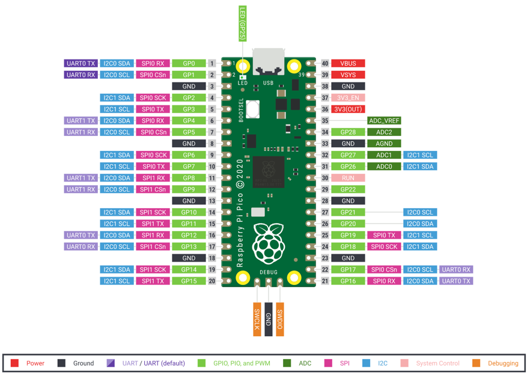

# Raspberry Pi Pico Micropython Base Robot

## Video

Here is a video of the robot in action:

[YouTube Video](https://youtu.be/0d3tF1oXu90)

Note that the speed and distance before you turn can be adjusted.  You can see I didn't quite get the distance right and the robot bumps into some of the barriers.

## Hardware




[Detailed Parts List Google Sheet](https://docs.google.com/spreadsheets/d/1zxPBhhxUG-Uuz9ZlNKY35JYVvpMbK2lfSP81EWPcYM0/edit?usp=sharing)

### Motor Driver


## Software

## I2C Scanner
```py
import machine
sda=machine.Pin(0) # row one on our standard Pico breadboard
scl=machine.Pin(1) # row two on our standard Pico breadboard
i2c=machine.I2C(0, sda=sda, scl=scl, freq=400000)
print("Device found at decimal", i2c.scan())
```

## Distance Sensor
VL53L0X

## Motor Drive Test

After we have the four wires connected to the motor driver, we need to make sure we get the right wires to the right motors and motor directions.  This program will help you debug this.

One thing to remember is that the "Right" refers to our orientation from the rear of the car or if we were sitting inside the car.  If the robot is facing you with the sensor in the front, it is the wheel on the left that we call the "RIGHT" wheel.  Very confusing!  Using this naming convention will pay of as we are walking behind larger robots.

```py
from machine import Pin, PWM
import time # sleep

POWER_LEVEL = 65025 # usually a number from 30,000 to max of 65,025
# lower right pins with USB on top
RIGHT_FORWARD_PIN = 21
RIGHT_REVERSE_PIN = 20
LEFT_FORWARD_PIN = 18
LEFT_REVERSE_PIN = 19

right_forward = PWM(Pin(RIGHT_FORWARD_PIN))
right_reverse = PWM(Pin(RIGHT_REVERSE_PIN))
left_forward = PWM(Pin(LEFT_FORWARD_PIN))
left_reverse = PWM(Pin(LEFT_REVERSE_PIN))


def spin_wheel(pwm):
        pwm.duty_u16(POWER_LEVEL)
        time.sleep(3)
        pwm.duty_u16(0)
        time.sleep(2)

while True:
    print('right forward')
    spin_wheel(right_forward)
    
    print('right reverse')
    spin_wheel(right_reverse)
    
    print('left foward')
    spin_wheel(left_forward)
    
    print('left_reverse')
    spin_wheel(left_reverse)
```

After you load this program, watch which wheels turn and in what direction.

## Drive Functions

We will define Python functions for forward, reverse, turn right and turn left.

```py
```

## Collision Avoidance Logic

## Final Program

To get this to work on battery power up you must name the program **main.py** and save it on the Raspberry Pi Pico.

Make sure you have the distance sensor driver installed.

```py
from machine import Pin, PWM
from utime import sleep
import VL53L0X

# used to blink the onboard LED
led_onboard = machine.Pin(25, machine.Pin.OUT)

# driving parameters
POWER_LEVEL = 40000 # use a value from 20000 to 65025
TURN_THRESHOLD = 400 # 25 cm
TURN_TIME = .25 # seconds of turning
BACKUP_TIME = .75 # seconds of backing up if obstacle deteced

# Motor pins to the L293 H-Bridge
RIGHT_FORWARD_PIN = 21
RIGHT_REVERSE_PIN = 20
LEFT_FORWARD_PIN = 18
LEFT_REVERSE_PIN = 19

# setup the PWM objects
right_forward = PWM(Pin(RIGHT_FORWARD_PIN))
right_reverse = PWM(Pin(RIGHT_REVERSE_PIN))
left_forward = PWM(Pin(LEFT_FORWARD_PIN))
left_reverse = PWM(Pin(LEFT_REVERSE_PIN))

sda=machine.Pin(16) # row one on our standard Pico breadboard
scl=machine.Pin(17) # row two on our standard Pico breadboard
i2c=machine.I2C(0, sda=sda, scl=scl)

# Create a VL53L0X object
tof = VL53L0X.VL53L0X(i2c)


    
def turn_motor_on(pwm):
   pwm.duty_u16(65025)

def turn_motor_off(pwm):
   pwm.duty_u16(0)

def forward():
    turn_motor_on(right_forward)
    turn_motor_on(left_forward)
    turn_motor_off(right_reverse)
    turn_motor_off(left_reverse)

def reverse():
    turn_motor_on(right_reverse)
    turn_motor_on(left_reverse)
    turn_motor_off(right_forward)
    turn_motor_off(left_forward)

def turn_right():
    turn_motor_on(right_forward)
    turn_motor_on(left_reverse)
    turn_motor_off(right_reverse)
    turn_motor_off(left_forward)

def turn_left():
    turn_motor_on(right_reverse)
    turn_motor_on(left_forward)
    turn_motor_off(right_forward)
    turn_motor_off(left_reverse)

def stop():
    turn_motor_off(right_forward)
    turn_motor_off(right_reverse)
    turn_motor_off(left_forward)
    turn_motor_off(left_reverse)

def read_sensor_avg():
    total = 0
    for i in range(10):
        total = total + tof.read()
        sleep(.01)
    return int(total/10)

tof.start() # startup the sensor

while True:
    dist = read_sensor_avg();
    print(dist)
    
    if dist < TURN_THRESHOLD:
        print('object detected')
        reverse()
        sleep(BACKUP_TIME)
        led_onboard.high()
        turn_right()
        sleep(TURN_TIME)
    else:
        if dist > 1300:
            print('no signal')
            led_onboard.low()
        else:
            print('Go forward')
            led_onboard.high()
        forward()

            

```
