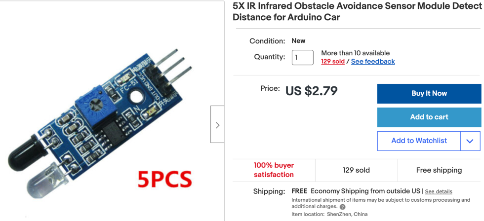

# IR Collision Avoidance Bot

Instead of our time-of-flight sensor used in our base robot, this robot uses three low-cost  IR distance sensors.

## Purchasing IR Distance Sensors



## Connecting the IR Sensors

```py
# connections to the three IR distance sensors
left = Pin(8, Pin.IN, Pin.PULL_DOWN)
center = Pin(7, Pin.IN, Pin.PULL_DOWN)
right = Pin(6, Pin.IN, Pin.PULL_DOWN)
```

## Connecting the Speaker

This robot has an optional speaker connected to GPIO Pin 21.  This allows us to "hear" what signals are coming into the robot  It will generate a different tone if the left, center or right sensor is detecting an object and an different tone for going straight, reversing and turning.

The speaker is a small buzzer or a Piezoelectric speaker that can be purchased for around $1.  It has one wire connected to the GPIO pin and the other connected to any GND pin or GND rail on the breadboard.

Here are the lines related to setting up the speaker code.
```py
SPEAKER_PIN = 21
# create a Pulse Width Modulation Object on this pin
speaker = PWM(Pin(SPEAKER_PIN))
```

## Drive Logic

The three IR sensors go LOW if there is an item in front of them.  So the statement:

```py
center.value()
```

will normally be HIGH if there is nothing in front of the robot.

Our main logic look will look like the following:

```py
while True:
    if left.value()==0:
        turn_right()
    if center.value()==0:
        reverse()
    if right.value()==0:
        turn_left()
    if left.value() and center.value() and right.value():
        forward()
```

## Full Program

```py
from machine import Pin, PWM
from utime import sleep
import ssd1306

# Motor pins to the L293 H-Bridge
RIGHT_FORWARD_PIN = 17
RIGHT_REVERSE_PIN = 16
LEFT_FORWARD_PIN = 18
LEFT_REVERSE_PIN = 19

right_forward = PWM(Pin(RIGHT_FORWARD_PIN))
right_reverse = PWM(Pin(RIGHT_REVERSE_PIN))
left_forward = PWM(Pin(LEFT_FORWARD_PIN))
left_reverse = PWM(Pin(LEFT_REVERSE_PIN))

# connections to the three IR distance sensors
left = Pin(8, Pin.IN, Pin.PULL_DOWN)
center = Pin(7, Pin.IN, Pin.PULL_DOWN)
right = Pin(6, Pin.IN, Pin.PULL_DOWN)

SPEAKER_PIN = 21
# create a Pulse Width Modulation Object on this pin
speaker = PWM(Pin(SPEAKER_PIN))

WIDTH  = 128
HEIGHT = 64
CS = machine.Pin(1)
SCL = machine.Pin(2)
SDA = machine.Pin(3)
DC = machine.Pin(4)
RES = machine.Pin(5)
spi=machine.SPI(0, sck=SCL, mosi=SDA)
oled = ssd1306.SSD1306_SPI(WIDTH, HEIGHT, spi, DC, RES, CS)

def turn_motor_on(pwm):
   pwm.duty_u16(65025)

def turn_motor_off(pwm):
   pwm.duty_u16(0)

def forward():
    turn_motor_on(right_forward)
    turn_motor_on(left_forward)

def reverse():
    turn_motor_on(right_reverse)
    turn_motor_on(left_reverse)

def turn_right():
    turn_motor_on(right_forward)
    turn_motor_on(left_reverse)
    
def turn_left():
    turn_motor_on(right_reverse)
    turn_motor_on(left_forward)
    
def sound_off():
    speaker.duty_u16(0)
    
def left_tone():
    speaker.duty_u16(1000)
    speaker.freq(700) # 1 Kilohertz
    sleep(.5) # wait a 1/4 second
    sound_off()

def center_tone():
    speaker.duty_u16(1000)
    speaker.freq(900)
    sleep(.5)
    sound_off()

def right_tone():
    speaker.duty_u16(1000)
    speaker.freq(600)
    sleep(.5)
    sound_off()

def forward_tone():
    speaker.duty_u16(1000)
    speaker.freq(400)
    sleep(.1)
    speaker.freq(900)
    sleep(.1)
    speaker.freq(1200)
    sleep(.1)
    sound_off()
    
def update_oled():
    oled.fill(0)
    oled.text("CoderDojo Rocks!", 0, 0, 1)
    
    oled.text("Left:", 0, 10, 1)
    oled.text(str(left.value()), 50, 10, 1)

    
    oled.text("Center:", 0, 20, 1)
    oled.text(str(center.value()), 60, 20, 1)
    
    oled.text("Right:", 0, 30, 1)
    oled.text(str(right.value()), 55, 30, 1)
    
    BAR_WIDTH = 40
    BAR_HEIGHT = 20
    if left.value():
        oled.fill_rect(WIDTH-40, 50, BAR_WIDTH, BAR_HEIGHT, 0)
    else:
        oled.fill_rect(WIDTH-40, 50, BAR_WIDTH, BAR_HEIGHT, 1)
    
    if center.value():
        oled.fill_rect(50, 50, BAR_WIDTH, BAR_HEIGHT, 0)
    else:
        oled.fill_rect(50, 50, BAR_WIDTH, BAR_HEIGHT, 1)
        
    if right.value():
        oled.fill_rect(0, 50, BAR_WIDTH, BAR_HEIGHT, 0)
    else:
        oled.fill_rect(0, 50, BAR_WIDTH, BAR_HEIGHT, 1)
        
    oled.show()


# 0=stopped, 1=forward, 2=turing right, 3=turning left
drive_state = 0
counter = 0
while True:
    if left.value()==0:
        print('Left')
        #left_tone()
        turn_right()
        update_oled()
        drive_state = 2
    if center.value()==0:
        print('Center')
        center_tone()
        reverse()
        update_oled()
        drive_state = 0
    if right.value()==0:
        print('Right')
        #right_tone()
        turn_left()
        update_oled()
        drive_state = 3
        
    # if (left.value()==1) and (center.value()==1) and (right.value()==1):
    if left.value() and center.value() and right.value():
        print('Go forward!')    
        drive_state = 1
        # forward_tone()
        forward()
        update_oled()
    print("counter: ", counter)
    counter += 1
    sleep(.25)
```

Pins GP6, 7, 8 and 9