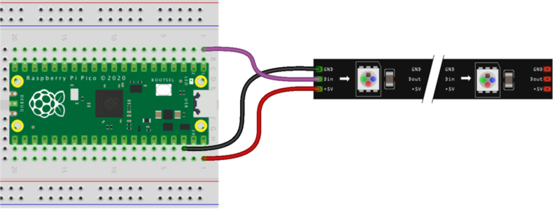
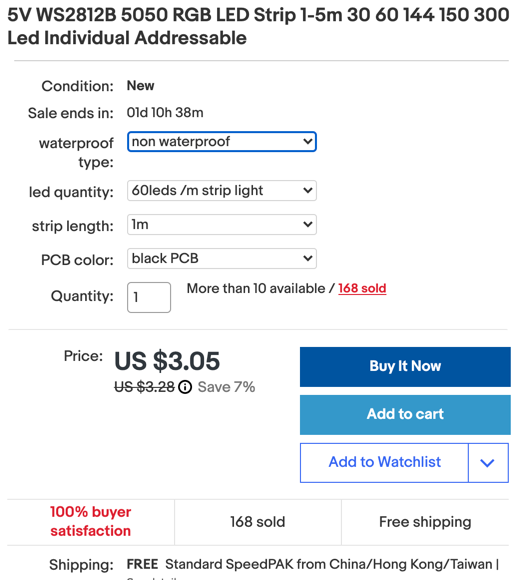
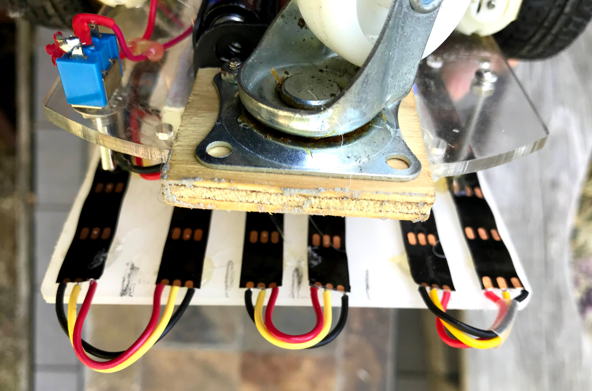
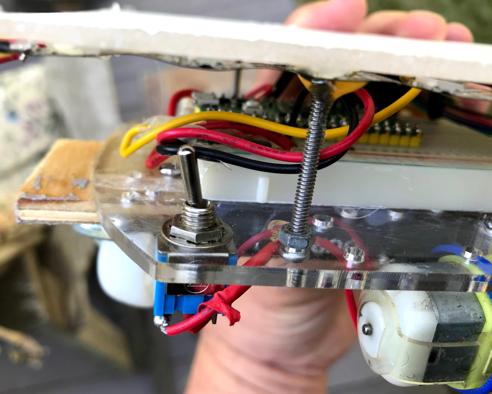
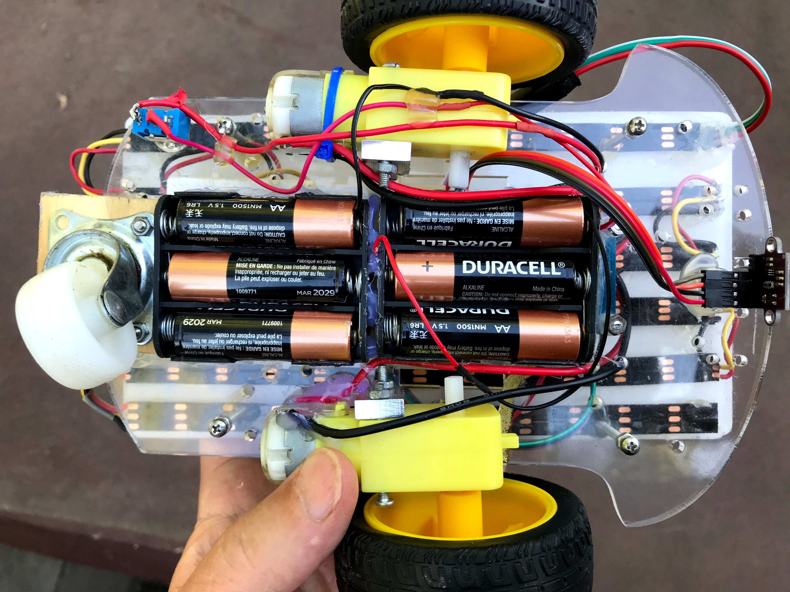
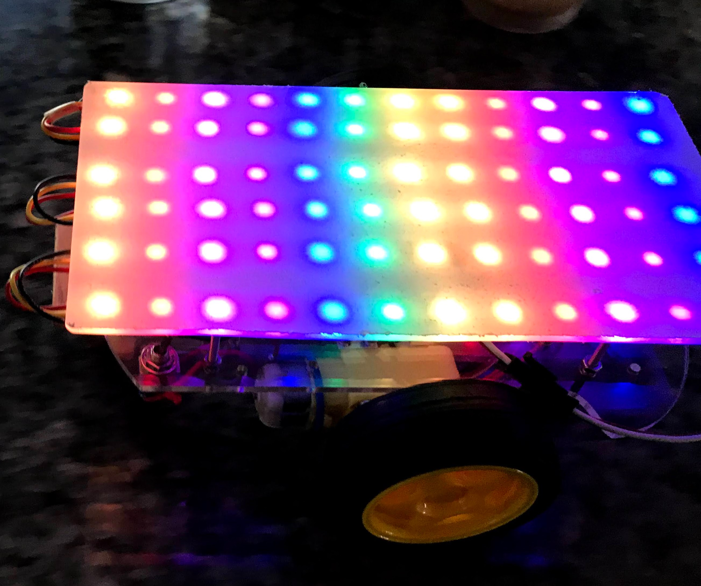

# Rainbow Bot


This robot takes our base robot and adds an LED strip arranged in a 12X6 pixel grid to display colors and patterns based on what the robot is doing or thinking about.

We use the same materials as our [Base Robot](02-base-bot.md) but we add a low-cost addressable LED strips that are easy to hook up with just power, ground and data wires added to our breadboard.  The LED is known as an addressable LED strip since you can individually program each LED.  The standard is called the  WS-2812B LED strip and is often called a NeoPixel LED strip (The Adafruit Term).  We also used a Python library called a Neopixel micropython library, although the library is not created or maintained by Adafruit.


<iframe width="560" height="315" src="https://www.youtube.com/embed/HZp5nx0aJ40" title="YouTube video player" frameborder="0" allow="accelerometer; autoplay; clipboard-write; encrypted-media; gyroscope; picture-in-picture" allowfullscreen></iframe>




Of course, you can also add longer LED strips and program the patterns in interesting ways.

## Part 1: Ordering The LED Strip

The LED strips come in a variety of lengths, density and packing.  We use the 1 meter long strips that have 60 pixels/meter. These strips are easy to cut apart and solder.  We like the black backgrounds but they also come with white.  The LED strips come with three packaging options:

1. No waterproofing - these are fine for our indoor robots
2. Waterproofing with the strips coated in silicon rubber called IP65 waterproofing
3. Waterproofing with the strips encased in a flexible rubber sleeve

The waterproofing options tend to be a little more expensive but can also provide a bit more protection for the components on the strips.  Waterproofing keeps moisture and dust out of the circuits, but does not mean that they can be submerged under water.

A sample place to purchase them is [here](https://www.ebay.com/itm/333953423650?hash=item4dc12cd922%3Ag%3AsxcAAOSwND9gYtgi&LH_BIN=1)



We can take a $3 strip of 60 LEDs and cut them up into six segments of 10 LEDs each for a cost of around 50 cents per strip.  We solder stranded wire to the segments and then put 22 gauge solid wire to make them easy to put in the breadboards.

## Connecting the LED Strips



## Adding a Standoff



## Upgrading to 9 Volt Power

Our base robot only needed power for the motors.  This robot has 72 RGB LEDs so it might draw more power.  So we upgraded the 6 volt battery pack with 4 AA batteries to two packs of 3 batteries for a total of 9 volts.  This allows the robot to continue to run even when the batteries are partially drained.  The battery packs must be wired in series to deliver the full 9 volts to the input of the motor controller where it powers the motors and also runs though a voltage regulator to power the reset of the robot.



## 72 Pixel Configuration

Here is the top view of the LEDs shining through the clear plexiglass.



You can see the individual LEDs in this configuration.  By adding a small space between the plexiglass and a diffusion layer you can get a much more uniform color distribution over the top surface of the robot.

## Part 2: Making The Connections
The LED strips use 5 volts of power and have a GND and a data connector.  To make the connections we connect the center pin to Pin 0 (upper left corner of the Pico), the GND to the ground rail and the 5 volt to the 5 volt power rail.

## Part 3: Adding the Neopixel Library


## Part 4: Testing Your Code
In our first test, we will just make the first pixel on the LED strip blink bright red.

```py
import machine, neopixel, time
# Set the pin number and number of pixels
LED_PIN = machine.Pin(4)
NUMBER_PIXELS = 12
np = neopixel.NeoPixel(LED_PIN, NUMBER_PIXELS)

# blink the first pixel red

while True:
    np[0] = (255, 0, 0)
    np.write()
    time.sleep(1)
    np[0] = (0, 0, 0)
    np.write()
    time.sleep(1)
```

## Functions For Drawing on Matrix
The numbering of the pixels is a bit odd.  The first 12 are 0 to 11, but the second 12 pixels are in reverse order, so the second row counts from 23 down to 13.  Here are some functions that demonstrate this:

```py
import time
from neopixel import Neopixel

numpix = 72
strip = Neopixel(numpix, 0, 0, "GRB")

red = (255, 0, 0)
orange = (255, 150, 0)
yellow = (255, 255, 0)
green = (0, 255, 0)
blue = (0, 0, 255)
indigo = (75, 0, 130)
violet = (138, 43, 226)
colors = (red, orange, yellow, green, blue, indigo, violet)

strip.brightness(255)

def color_wipe():
    for color in colors:
        for i in range(numpix):
            strip.set_pixel(i, color)
            strip.show()
            time.sleep(0.01)

def color_wipe_2():
    for color in colors:
        for i in range(12):
            strip.set_pixel(i, color)
            strip.set_pixel(i+12, color)
            strip.set_pixel(i+24, color)
            strip.set_pixel(i+36, color)
            strip.set_pixel(i+48, color)
            strip.set_pixel(i+60, color)
            strip.show()
            time.sleep(0.01)

def color_wipe_3():
    for color in colors:
        for i in range(12):
            strip.set_pixel(i, color)
            strip.set_pixel(23-i, color)
            strip.set_pixel(i+24, color)
            strip.set_pixel(47-i, color)
            strip.set_pixel(48+i, color)
            strip.set_pixel(71-i, color)
            strip.show()
            time.sleep(0.3)

# offset is the color to start (0 to 6)
# dir is 1 for forward and -1 for reverse
def color_wipe_4(offset, dir):
    for i in range(12):
        if dir == 1:
            this_color = colors[ ((i-offset) %7 )]
        else:
            this_color = colors[ ((i+offset) %7 )]
        strip.set_pixel(i, this_color)
        strip.set_pixel(23-i, this_color)
        strip.set_pixel(i+24, this_color)
        strip.set_pixel(47-i, this_color)
        strip.set_pixel(48+i, this_color)
        strip.set_pixel(71-i, this_color)
        strip.show()
        # time.sleep(0.01)
            
while True:
    for counter in range(100):
        color_wipe_4(counter %7, 1)
    for counter in range(100):
        color_wipe_4(counter%7, -1)  
```

## Full Source Code
We now combine the motor controls, the distance sensor and the LED functions so that a moving rainbow pattern moves from to back as the robot moves forward.  If the robot encounters an obstacle, the robot will backup and change the direction of the rainbow.  After it backs up a bit it will turn and move forward again.

main.py
```py
from machine import Pin, PWM
from time import sleep
from machine import Pin
from machine import I2C
import VL53L0X
from neopixel import Neopixel

# Motor Code
# lower right pins with USB on top
RIGHT_FORWARD_PIN = 19
RIGHT_REVERSE_PIN = 18
LEFT_FORWARD_PIN = 20
LEFT_REVERSE_PIN = 21

right_forward = PWM(Pin(RIGHT_FORWARD_PIN))
right_reverse = PWM(Pin(RIGHT_REVERSE_PIN))
left_forward = PWM(Pin(LEFT_FORWARD_PIN))
left_reverse = PWM(Pin(LEFT_REVERSE_PIN))

# Sensor Code
sda=machine.Pin(16)
scl=machine.Pin(17)
i2c=machine.I2C(0, sda=sda, scl=scl)

# Create a VL53L0X object
tof = VL53L0X.VL53L0X(i2c)
tof.start() # startup the sensor

# used to blink the onboard LED
led_onboard = machine.Pin(25, machine.Pin.OUT)

# LED Code
numpix = 72
strip = Neopixel(numpix, 0, 0, "GRB")
# we turn the brightness way down to not oversaturate the brightness in the video
strip.brightness(20)

# driving parameters
POWER_LEVEL = 30000 # use a value from 20000 to 65025
TURN_THRESHOLD = 400 # 25 cm
TURN_TIME = .25 # seconds of turning
BACKUP_TIME = .75 # seconds of backing up if obstacle detected

red = (255, 0, 0)
orange = (255, 165, 0)
yellow = (255, 255, 0)
green = (0, 255, 0)
blue = (0, 0, 255)
indigo = (75, 0, 130)
violet = (138, 43, 226)
colors = (red, orange, yellow, green, blue, indigo, violet)

def turn_motor_on(pwm):
   pwm.duty_u16(POWER_LEVEL)

def turn_motor_off(pwm):
   pwm.duty_u16(0)

def forward():
    turn_motor_on(right_forward)
    turn_motor_on(left_forward)
    turn_motor_off(right_reverse)
    turn_motor_off(left_reverse)
    #for i in range(numpix):
    #    strip.set_pixel(i, green)
    #strip.show()

def reverse():
    turn_motor_on(right_reverse)
    turn_motor_on(left_reverse)
    turn_motor_off(right_forward)
    turn_motor_off(left_forward)
    #for i in range(numpix):
    #    strip.set_pixel(i, red)
    #strip.show()
    
def turn_right():
    turn_motor_on(right_forward)
    turn_motor_on(left_reverse)
    turn_motor_off(right_reverse)
    turn_motor_off(left_forward)
    #for i in range(numpix):
    #    strip.set_pixel(i, blue)
    #strip.show()
    
def turn_left():
    turn_motor_on(right_reverse)
    turn_motor_on(left_forward)
    turn_motor_off(right_forward)
    turn_motor_off(left_reverse)
    #for i in range(numpix):
    #    strip.set_pixel(i, yellow)
    #strip.show()
    
def stop():
    turn_motor_off(right_forward)
    turn_motor_off(right_reverse)
    turn_motor_off(left_forward)
    turn_motor_off(left_reverse)
    for i in range(numpix):
        strip.set_pixel(i, violet)
    strip.show()

def read_sensor_avg():
    total = 0
    for i in range(10):
        total = total + tof.read()
        sleep(.01)
    return int(total/10)

# offset is the color to start (0 to 6)
# dir is 1 for forward and -1 for reverse
def color_wipe_4(offset, dir):
    for i in range(12):
        if dir == 1:
            this_color = colors[ ((i-offset) %7 )]
        else:
            this_color = colors[ ((i+offset) %7 )]
        strip.set_pixel(i, this_color)
        strip.set_pixel(23-i, this_color)
        strip.set_pixel(i+24, this_color)
        strip.set_pixel(47-i, this_color)
        strip.set_pixel(48+i, this_color)
        strip.set_pixel(71-i, this_color)
        strip.show()
        # time.sleep(0.01)

counter = 0
while True:
    dist = read_sensor_avg() 
    if dist < TURN_THRESHOLD:
        print('object detected')
        reverse()
        
        color_wipe_4(counter % 7, -1)
        sleep(.1)
        counter += 1
        
        color_wipe_4(counter % 7, -1)
        sleep(.1)
        counter += 1

        color_wipe_4(counter % 7, -1)
        sleep(.1)
        counter += 1        

        color_wipe_4(counter % 7, -1)
        sleep(.1)
        counter += 1        

        color_wipe_4(counter % 7, -1)
        sleep(.1)
        counter += 1        

        turn_right()
        color_wipe_4(counter % 7, -1)
        sleep(.1)
        counter += 1        

        color_wipe_4(counter % 7, -1)
        sleep(.1)
        counter += 1        

        color_wipe_4(counter % 7, -1)
        sleep(.1)
        counter += 1        

    else:
        forward()
        color_wipe_4(counter % 7, 1)
    counter += 1
```

[Rainbow Bot Source Code](https://github.com/CoderDojoTC/micropython/tree/main/src/robots/rainbow-bot)
## References

1. Micropython [NeoPixel Library](https://docs.micropython.org/en/v1.15/esp8266/tutorial/neopixel.html)
