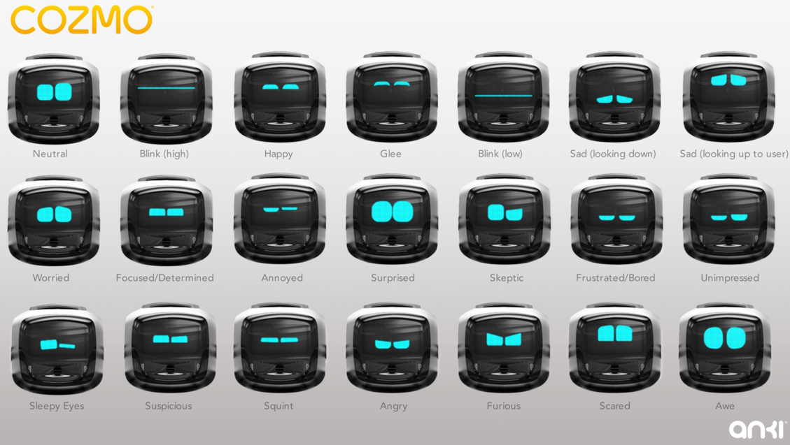

# MicroPython FaceBot

This lesson will allow you to draw simple faces on the display on the front of our robots.  The faces can reflect the emotions of your robot.  We are inspired by the faces on the 

