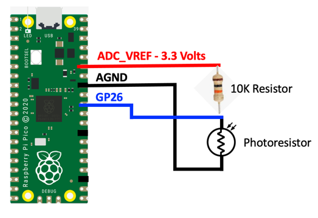

# Light Sensor with Raspberry Pi Pico in MicroPython

A photoresistor is a sensor that decreases resistance when light is shined on its surface.  With no light a photoresistor has high resistance in the range of megaohms.  As light shines on the surface the resistance drops to kiloohms.  We can use this effect as a light sensor.

To convert the variable resistance of a photoresistor to something we can measure with our microcontroller we will need to build a small circuit that includes a 10K ohm resistor.  We then measure the voltage between the photoresistor and the 10K resistor as light falls on the sensor.  The top and bottom of the circuit are tied to ground and a power rail.  This will move the voltage of the midpoint of the circuit.


<iframe width="560" height="315" src="https://www.youtube.com/embed/avEKpsV5gsE" title="YouTube video player" frameborder="0" allow="accelerometer; autoplay; clipboard-write; encrypted-media; gyroscope; picture-in-picture" allowfullscreen></iframe>

## Circuit



We want to make sure that we use the stable analog ground (AGND) and analog to reference voltage at either end of the circuit to protect the circuit from all the noise of the power in our processor.  Using other power and ground pins will work, but power fluctuations will make the result noisy. 

## Sample Code

Our program will first use the Analog to Digital Circuit (ADC0) as an input.  On the Pico this is on pin 26.

```py
import machine
import time
photo_pin = machine.ADC(26)

while True:
    val = photo_pin.read_u16()
    print(val)
    time.sleep(.2)
```

When you run the program a series of print values is displayed in the shell every 1/5th of a second.  You can also use the Thonny plot window to see how the numbers change and you cover and uncover detector from a light source.

## Experiments

1. What types of devices could use a light detector?
2. How does a night-light work?  How could you add an LED to the circuit so that the LED would turn on if the light level got too low?
3. Could you automatically adjust the brightness of LEDs on a costume to get brighter in a sunny room and dim if you enter a dark room?  What would that code look like?

## References

1. [Wikipedia Page on Photoresistor](https://en.wikipedia.org/wiki/Photoresistor)