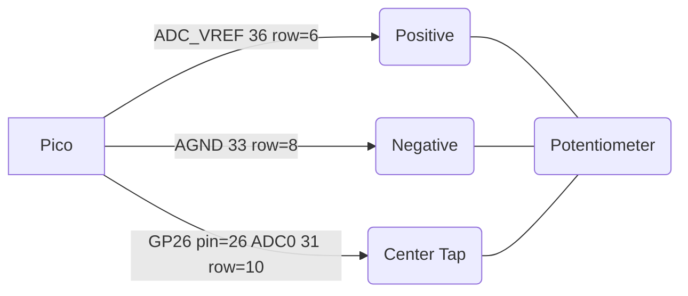

# Reading a Potentiometer

ADC_VREF is the ADC power supply (and reference) voltage, and is generated on Pico by filtering the 3.3V supply. This
pin can be used with an external reference if better ADC performance is required.
AGND is the ground reference for GPIO26-29, there is a separate analog ground plane running under these signals and
terminating at this pin.



Connect the positive to pin 35 ADC_REF (row 6 on the breadboard) and the negative to pin 33 AGND (row 8 on the breadboard).  The Pico has special noise reduction circuits to avoid power supply jitter on these reference pins.


## Sampling data
Sometimes the data coming from your Potentiometer is noisy.  You can sample the value multiple times and then average the values.

Here is a sample program.  Just pass in the pin and a count and it will return the average values.  This version waits 5 milliseconds between samples.

```py
def sample_pot(pin, count):
    total = 0
    for i in range(count):
        total += int(pin.read_u16())
        utime.sleep_ms(5)
    return int(total / count)
```

    
```python
pot_pin_1 = machine.ADC(26)
# return a value after sampling 10 times
sample_pot(pot_pin_1, 10)
```