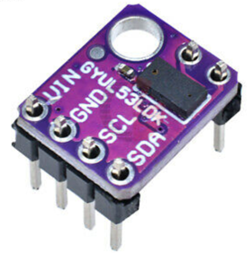

# VL53L0X Time-of-Flight Laser Ranging Module IR Distance Sensor


Figure: VL53L0X in the GY-530 package.

The VL53L0X is a low-cost ($5) time-of-flight light-based distance sensor that is easy to use.  It comes packaged in a I2C board and gives precise distance measurements up to 1.5 meters away.  It measures the time that light pulses take to travel to an object and back to estimate distance.  Light travels about 1 foot every nanosecond, so the timing inside this little chip must be very accurate.

The VL53L0X integrates a  group of Single Photon Avalanche Diodes (SPAD) and embeds ST Electronic's second generation FlightSense™ patented technology.  The VL53L0X’s 940 nm  emitter Vertical Cavity Surface-Emitting Laser (VCSEL), is safe for kids and totally invisible to the human eye.  Coupled with internal physical infrared filters, the sensor enables longer ranging distance, higher immunity to ambient light, and better robustness to cover glass optical crosstalk.

## Circuit
Hook the VCC to the 3.3 out of the Pico, the GND of the sensor to andy of the GND pins of the Pico and then connect the Clock and Data to two pins such as GIPO pins 16 and 17.

## I2C Scanner Test

We first run the I2C scanner program to verify that the sensor is connected correct and is responding to the I2C bus scan.

```py
import machine
sda=machine.Pin(0) # row one on our standard Pico breadboard
scl=machine.Pin(1) # row two on our standard Pico breadboard
i2c=machine.I2C(0, sda=sda, scl=scl, freq=400000)
print("Device found at decimal", i2c.scan())
```

This should return a single decimal number.

## Download The VL53L0X Driver

If you are using Thonny, you can try to use the "Manage Packages" menu and search for the driver.

We have a sample of the driver [here](https://github.com/CoderDojoTC/micropython/blob/main/src/drivers/VL53L0X.py)

## Create a Test Program

```py
# Test program for VL53L0X
import time
from machine import Pin
from machine import I2C
import VL53L0X

sda=machine.Pin(16) # lower right pin
scl=machine.Pin(17) # one up from lower right pin
i2c=machine.I2C(0, sda=sda, scl=scl, freq=400000)

# Create a VL53L0X object
tof = VL53L0X.VL53L0X(i2c)

while True:
    tof.start()
    tof.read()
    print(tof.read())
    tof.stop()
    time.sleep(0.1)
```

## Use the Thonny Plot


## Reference Purchase links

1. [ST Microelectronics](https://www.st.com/en/imaging-and-photonics-solutions/vl53l0x.html)
2. [User Manual](https://www.st.com/resource/en/user_manual/dm00279088-world-smallest-timeofflight-ranging-and-gesture-detection-sensor-application-programming-interface-stmicroelectronics.pdf)
3. [Ebay $4](https://www.ebay.com/itm/163960247303)
4. [Amazon $12](https://www.amazon.com/VL53L0X-Ranging-Distance-Measurement-Communication/dp/B07KDQ4XQ4)

## eBay

[qty 10 for $25](https://www.ebay.com/itm/294089704191?_trkparms=aid%3D1110013%26algo%3DHOMESPLICE.SIMRXI%26ao%3D1%26asc%3D232333%26meid%3D801d22bde5b0492b9bf25b83f5db6bab%26pid%3D100042%26rk%3D1%26rkt%3D3%26sd%3D313556965987%26itm%3D294089704191%26pmt%3D1%26noa%3D0%26pg%3D2508447%26algv%3DPersonalizedV5&_trksid=p2508447.c100042.m2062&amdata=cksum%3A294089704191801d22bde5b0492b9bf25b83f5db6bab%7Cenc%3AAQAFAAAB8CwJHOQPEmug4Oyzlih%252Fwh%252BnL5IO1ZGLhNU8Mre86yE3mPpr5Z2nF0yzyqMAi21lInzsea1TsKasH6WbuLk5kKptr374oiC0aiAFELJ2TSibW9y5eRtjKhL7g0A3nW3BOeEDJJz9gS03bXYao1qVTcKHURvD%252B9K2wjSGMTarhq%252Bp9mmzesOFmYNmlIzcZ6O7%252FeUO4eCL8xyqkENuP7yIF%252F9AQYDYs6EE%252B%252FrUWTGlZF49WFx2pelOb90bkPNPwQXss%252Fq3XPt3UkCzxnDhCLbtnTcv1LoW%252FAtyvmQv4oPce7nZ6HVupfgqrJeYMCHoh9R1BmRw3We79OV6MHnNvzBfDsVpg6hdYl7oa72moMqCzhxQs%252B0F1fE5gQF17Gk7mQzVOypaewXavOkagziWlpOJkB6qlYvu3EvZ96Md%252BElbqvCArK6NzmijoX9kwQvb10Km6QnsrZZsj%252Fh8tbTRUp8aEq%252FVZoSkZvHoi1EgvN07V6p2yGscAFhJcmm9UvVCRkLlTATJVbLB%252FYkQ9Ec2U%252BknlK6RQgYppl3ax4FHkLV08TfCIG0utL8TOOw6hUCyoGwdfYarFM6bs7%252F102QPzQ1r4zs8VmXuEbuJS6mKkIFjPL9uq6hGTDsBDohl6tgM%252FLjJX0MJngoUKV449xWyxg4sDAM%253D%7Campid%3APL_CLK%7Cclp%3A2508447)