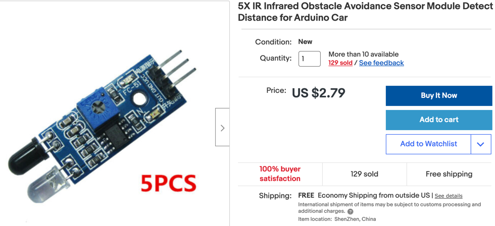

## IR Distance Sensors

IR distance sensors are low cost (five for $3) but may have problems working in rooms with outdoor lighting.  They have an adjustable potentiometer on them that can be used to adjust a triggering distance call the threshold distance.  The sensors return a HIGH signal if there is no object within the threshold distance and a LOW signal if there is an object within this distance.  Since the sensor threshold distance can not be adjusted programmatically they are best suited when you can manually adjust the potentiometer to change the threshold.



## Connections

These sensors have three wires:

1. GND - connect to a ground rail on your breadboard or directly to a GND ping on the Pico.
2. VCC - connect to the 5 volt power rail powered by the motor controller voltage regulator
3. OUT - a 5 volt digital signal that is usually 5 volts but is GND when triggered by an object


## Sample Python Code

```py
# connections to the three IR distance sensors
left = Pin(8, Pin.IN, Pin.PULL_DOWN)
center = Pin(7, Pin.IN, Pin.PULL_DOWN)
right = Pin(6, Pin.IN, Pin.PULL_DOWN)
```

## The KY-032
The KY-032 obstacle avoidance sensor is a four-wire distance-adjustable, infrared proximity sensor designed for wheeled robots. Also known as AD-032.

The sensor detection distance ranges from 2cm to 40cm, it can be adjusted by turning the potentiometer knob. The operating voltage is 3.3V-5V so it is suitable for a variety of microcontrollers like Arduino, ESP32, Teensy, ESP8266, Raspberry Pi, and others.

It has strong adaptability to ambient light and it is fairly accurate to sense changes in the surrounding environment.

## Speaker Test

```py
from machine import Pin, PWM
from utime import sleep


left = Pin(8, Pin.IN, Pin.PULL_DOWN)
center = Pin(7, Pin.IN, Pin.PULL_DOWN)
right = Pin(6, Pin.IN, Pin.PULL_DOWN)

SPEAKER_PIN = 21
# create a Pulse Width Modulation Object on this pin
speaker = PWM(Pin(SPEAKER_PIN))

def sound_off():
    speaker.duty_u16(0)
    
def left_tone():
    speaker.duty_u16(1000)
    speaker.freq(300) # 1 Kilohertz
    sleep(.5) # wait a 1/4 second
    sound_off()

def center_tone():
    speaker.duty_u16(1000)
    speaker.freq(800)
    sleep(.5)
    sound_off()

def right_tone():
    speaker.duty_u16(1000)
    speaker.freq(400)
    sleep(.5)
    sound_off()
    
def right_tone():
    speaker.duty_u16(1000)
    speaker.freq(800)
    sleep(.25)
    sound_off()

def forward_tone():
    speaker.duty_u16(1000)
    speaker.freq(400)
    sleep(.1)
    speaker.freq(900)
    sleep(.1)
    speaker.freq(1200)
    sleep(.1)
    sound_off()

# 0=stopped, 1=forward, 2=turing right, 3=turning left
drive_state = 0
while True:
    if left.value()==0:
        print('Left')
        left_tone()
        drive_state = 2
    if center.value()==0:
        print('Center')
        center_tone()
        drive_state = 0
    if right.value()==0:
        print('Right')
        right_tone()
        drive_state = 3
        
    # if (left.value()==1) and (center.value()==1) and (right.value()==1):
    if left.value() and center.value() and right.value():
        print('Go forward!')
        drive_state = 1
        forward_tone()
    sleep(.25)
```

## Full Program

```py
from machine import Pin, PWM
from utime import sleep
import ssd1306

# Motor pins to the L293 H-Bridge
RIGHT_FORWARD_PIN = 17
RIGHT_REVERSE_PIN = 16
LEFT_FORWARD_PIN = 18
LEFT_REVERSE_PIN = 19

right_forward = PWM(Pin(RIGHT_FORWARD_PIN))
right_reverse = PWM(Pin(RIGHT_REVERSE_PIN))
left_forward = PWM(Pin(LEFT_FORWARD_PIN))
left_reverse = PWM(Pin(LEFT_REVERSE_PIN))

# connections to the three IR distance sensors
left = Pin(8, Pin.IN, Pin.PULL_DOWN)
center = Pin(7, Pin.IN, Pin.PULL_DOWN)
right = Pin(6, Pin.IN, Pin.PULL_DOWN)

SPEAKER_PIN = 21
# create a Pulse Width Modulation Object on this pin
speaker = PWM(Pin(SPEAKER_PIN))

WIDTH  = 128
HEIGHT = 64
CS = machine.Pin(1)
SCL = machine.Pin(2)
SDA = machine.Pin(3)
DC = machine.Pin(4)
RES = machine.Pin(5)
spi=machine.SPI(0, sck=SCL, mosi=SDA)
oled = ssd1306.SSD1306_SPI(WIDTH, HEIGHT, spi, DC, RES, CS)

def turn_motor_on(pwm):
   pwm.duty_u16(65025)

def turn_motor_off(pwm):
   pwm.duty_u16(0)

def forward():
    turn_motor_on(right_forward)
    turn_motor_on(left_forward)

def reverse():
    turn_motor_on(right_reverse)
    turn_motor_on(left_reverse)

def turn_right():
    turn_motor_on(right_forward)
    turn_motor_on(left_reverse)
    
def turn_left():
    turn_motor_on(right_reverse)
    turn_motor_on(left_forward)
    
def sound_off():
    speaker.duty_u16(0)
    
def left_tone():
    speaker.duty_u16(1000)
    speaker.freq(700) # 1 Kilohertz
    sleep(.5) # wait a 1/4 second
    sound_off()

def center_tone():
    speaker.duty_u16(1000)
    speaker.freq(900)
    sleep(.5)
    sound_off()

def right_tone():
    speaker.duty_u16(1000)
    speaker.freq(600)
    sleep(.5)
    sound_off()

def forward_tone():
    speaker.duty_u16(1000)
    speaker.freq(400)
    sleep(.1)
    speaker.freq(900)
    sleep(.1)
    speaker.freq(1200)
    sleep(.1)
    sound_off()
    
def update_oled():
    oled.fill(0)
    oled.text("CoderDojo Rocks!", 0, 0, 1)
    
    oled.text("Left:", 0, 10, 1)
    oled.text(str(left.value()), 50, 10, 1)

    
    oled.text("Center:", 0, 20, 1)
    oled.text(str(center.value()), 60, 20, 1)
    
    oled.text("Right:", 0, 30, 1)
    oled.text(str(right.value()), 55, 30, 1)
    
    BAR_WIDTH = 40
    BAR_HEIGHT = 20
    if left.value():
        oled.fill_rect(WIDTH-40, 50, BAR_WIDTH, BAR_HEIGHT, 0)
    else:
        oled.fill_rect(WIDTH-40, 50, BAR_WIDTH, BAR_HEIGHT, 1)
    
    if center.value():
        oled.fill_rect(50, 50, BAR_WIDTH, BAR_HEIGHT, 0)
    else:
        oled.fill_rect(50, 50, BAR_WIDTH, BAR_HEIGHT, 1)
        
    if right.value():
        oled.fill_rect(0, 50, BAR_WIDTH, BAR_HEIGHT, 0)
    else:
        oled.fill_rect(0, 50, BAR_WIDTH, BAR_HEIGHT, 1)
        
    oled.show()

# 0=stopped, 1=forward, 2=turing right, 3=turning left
drive_state = 0
counter = 0
while True:
    if left.value()==0:
        print('Left')
        #left_tone()
        turn_right()
        update_oled()
        drive_state = 2
    if center.value()==0:
        print('Center')
        center_tone()
        reverse()
        update_oled()
        drive_state = 0
    if right.value()==0:
        print('Right')
        #right_tone()
        turn_left()
        update_oled()
        drive_state = 3
        
    # if (left.value()==1) and (center.value()==1) and (right.value()==1):
    if left.value() and center.value() and right.value():
        print('Go forward!')    
        drive_state = 1
        # forward_tone()
        forward()
        update_oled()
    print("counter: ", counter)
    counter += 1
    sleep(.25)
    ```

    ## More to Explore

    1. Try to change the values of the potentiometers on the sensors.  What is the minimum and maximum distance you can detect and object?
    2.  Does the reflectivity of the object impact the distance of the object?
    3. If you put a small mirror in front of the sensor what happens to the distance measured?
    4. Place the robot near bright sun in a window or try the robot outdoors on both a cloudy day and a sunny day?  What is the change is accuracy of the sensors under these conditions?  What about running the robot in the dark?
