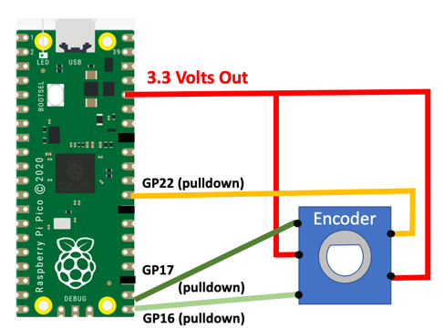
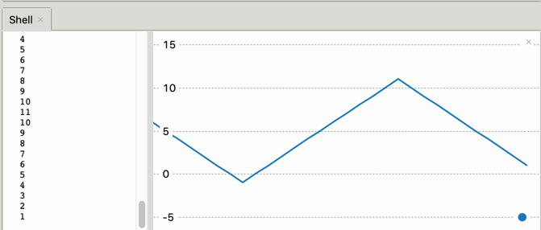

# Rotary Encoder

A rotary encoder, or more specifically a directional rotary encoder, is similar to a potentiometer in some ways.  It is a knob that you turn to adjust a value.  But unlike a potentiometer, an encoder is far more flexible in the range and precision of values it can control.

Rotary encoders can be thought of as two concentric rings of switches that go on and off.  The switches are placed so that you can tell the direction of rotation by the order that two switches get turned on and off.


We will be using a low-cost ($1 USD) encoder that has five connectors, three for the direction and one for a momentary switch that is closed when you press the knob in.



We hooked up the outer pins of the encoder to GPIO pins 16 and 17 in the lower right corner of the Pico.

Then we hooked the center pin to the 3.3 volt rail.  The Pico likes to pull switches down from the 3.3 volt rail.  This means that we will not be connecting any of the pins to GND.

We also hooked up the central press button to GPIO 22 and the 3.3 volt rail.

We then ran this code and turned the knob:

```py
import time
from machine import Pin

rotaryA = Pin(16, Pin.IN, Pin.PULL_DOWN)
rotaryB = Pin(17, Pin.IN, Pin.PULL_DOWN)

while True:
    print(rotaryA.value(), end='')
    print(rotaryB.value())
    time.sleep(.1)
```

the results look like the following lines:

```
00
00
00
10
01
00
00
00
11
00
00
00
01
11
00
```

Note that the bit values the encoders switches (on or off as 0 and 1) are place next to each other on the same line.  We did this by making the end of the first print statement be the null string not the default newline character.

This program prints out a LONG stream of numbers, mostly of the value ```00```.  The values are printed 10 times each second.  Now let's take a closer look at only the values that change.

What we would like to do is now only print numbers if there is a change.  To do this we will "pack" binary values into a two bit number by shifting the A pin value to the left:

```py
import time
from machine import Pin

rotaryA = Pin(16, Pin.IN, Pin.PULL_DOWN)
rotaryB = Pin(17, Pin.IN, Pin.PULL_DOWN)

# we set the old value to zero for both bits being off
old_combined = 0
while True:
    A_val = rotaryA.value()
    B_val = rotaryB.value()
    # a sifts by one bit and then is ORed with the B calue
    new_combined = (A_val << 1) | B_val
    if new_combined != old_combined:
            print(A_val, end='')
            print(B_val)
            old_combined = new_combined
    time.sleep(.1)
```

Now we get values that look like this:


```
01
11
00
01
11
00
01
11
10
00
10
00
01
11
00
10
```
Turning the knob clockwise we see the ```01``` before the 11 frequently


Turning the know counterclockwise:

```
00
10
11
00
10
11
00
11
00
10
00
10
01
00
```

Here we see the reverse ```10``` pattern occur more frequently.  But there is noise in the switches as they open and close due to small variations in the contacts as they move.


```
import time
from machine import Pin

rotaryA = Pin(16, Pin.IN, Pin.PULL_DOWN)
rotaryB = Pin(17, Pin.IN, Pin.PULL_DOWN)

# we set the old value to zero for both bits being off
old_combined = 0
while True:
    A_val = rotaryA.value()
    B_val = rotaryB.value()
    # a sifts by one bit and then is ORed with the B calue
    new_combined = (A_val << 1) | B_val
    if new_combined != old_combined:
            #print(A_val, end='')
            #print(B_val)
            old_combined = new_combined
    if A_val == 0 and B_val == 1:
        print('clock')
    elif A_val == 1 and B_val == 0:
        print('counter clock')
    time.sleep(.1)
```

## The Rotory Class

I started with [this rotary class](https://github.com/gurgleapps/rotary-encoder/blob/main/rotary.py).  However, my setup did not work with the one she created.  The numbers incremented, but they didn't decrement.  I had to change the pins to use the PULL_DOWN settings in the init method.

```py
import machine
import utime as time
from machine import Pin
import micropython

class Rotary:
    
    ROT_CW = 1
    ROT_CCW = 2
    SW_PRESS = 4
    SW_RELEASE = 8
    
    def __init__(self,dt,clk,sw):
        self.dt_pin = Pin(dt, Pin.IN, Pin.PULL_DOWN)
        self.clk_pin = Pin(clk, Pin.IN, Pin.PULL_DOWN)
        self.sw_pin = Pin(sw, Pin.IN, Pin.PULL_DOWN)
        self.last_status = (self.dt_pin.value() << 1) | self.clk_pin.value()
        self.dt_pin.irq(handler=self.rotary_change, trigger=Pin.IRQ_FALLING | Pin.IRQ_RISING )
        self.clk_pin.irq(handler=self.rotary_change, trigger=Pin.IRQ_FALLING | Pin.IRQ_RISING )
        self.sw_pin.irq(handler=self.switch_detect, trigger=Pin.IRQ_FALLING | Pin.IRQ_RISING )
        self.handlers = []
        self.last_button_status = self.sw_pin.value()
        
    def rotary_change(self, pin):
        new_status = (self.dt_pin.value() << 1) | self.clk_pin.value()
        if new_status == self.last_status:
            return
        transition = (self.last_status << 2) | new_status
        if transition == 0b1110:
            micropython.schedule(self.call_handlers, Rotary.ROT_CW)
        elif transition == 0b1101:
            micropython.schedule(self.call_handlers, Rotary.ROT_CCW)
        self.last_status = new_status
        
    def switch_detect(self,pin):
        if self.last_button_status == self.sw_pin.value():
            return
        self.last_button_status = self.sw_pin.value()
        if self.sw_pin.value():
            micropython.schedule(self.call_handlers, Rotary.SW_RELEASE)
        else:
            micropython.schedule(self.call_handlers, Rotary.SW_PRESS)
            
    def add_handler(self, handler):
        self.handlers.append(handler)
    
    def call_handlers(self, type):
        for handler in self.handlers:
            handler(type)
```

The following were the lines that I changed:

```py
    self.dt_pin = Pin(dt, Pin.IN, Pin.PULL_DOWN)
    self.clk_pin = Pin(clk, Pin.IN, Pin.PULL_DOWN)
    self.sw_pin = Pin(sw, Pin.IN, Pin.PULL_DOWN)
```

## Testing Script

```py
from rotary import Rotary
import utime as time
from machine import Pin

# GPIO Pins 16 and 17 are for the encoder pins. 22 is the button press switch.
rotary = Rotary(16, 17, 22)
val = 0

def rotary_changed(change):
    global val
    if change == Rotary.ROT_CW:
        val = val + 1
        print(val)
    elif change == Rotary.ROT_CCW:
        val = val - 1
        print(val)
    elif change == Rotary.SW_PRESS:
        print('PRESS')
    elif change == Rotary.SW_RELEASE:
        print('RELEASE')
        
rotary.add_handler(rotary_changed)

while True:
    time.sleep(0.1)
```

## Adding Plot

Now I can move the knob back and forth and get consistent values that go up and down.  You can turn on the plot function of Thonny to see the values consistently go up and down.



## Mysterious Runtime Error on Scheduling Queue

I did notice that the Shell output did register the following errors:

```
Traceback (most recent call last):
  File "rotary.py", line 30, in rotary_change
RuntimeError: schedule queue full
```

The error also occurred on line 32.

The following lines generated this error:

```py
micropython.schedule(self.call_handlers, Rotary.ROT_CW)
micropython.schedule(self.call_handlers, Rotary.ROT_CCW)

```

This error did not seem to impact the execution of the code.  My suspicion is that this is a bug in the Micropython firmware.