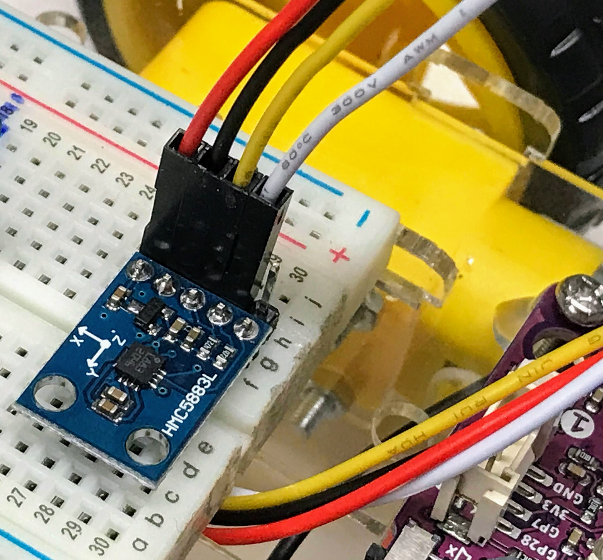

# MicroPython Compass Lab

[Digital Compass Lab Video](https://www.youtube.com/shorts/ed3TPN7XvnM)



This lab will use the popular HML5883L chip to show how we can sense a magnetic field and allow our robots to sense the direction they are going.

## About the HML5883L

The HMC5883L is a multi-chip module able to measure magnetic sensing. It can communicate with an I2C digital interface with other devices in order to let creating applications such as low-cost compass, being used in many electronic fields like mobile phones, netbooks, consumer electronics, auto navigation systems, and personal navigation devices.

The module works with a low voltage supply (from 2.16 to 3.6V) and also has a low power consumption (100 μA).

HMC5883L has a 1° to 2° degrees heading accuracy, which is enough for a wide number of applications. It also allows setting its internal gain to increase resolution with a 3-bit gain control register. But increasing gain also increases noise effects.

## Pinout

The HMC5883L pinout has 5 PINs:

1. Vcc: Connect to the 3.3 volt rail of the breadboard or power supply
2. GND: Ground
3. SCL: I2C clock
4. SDA: I2C data
5. DRDY:  Data ready.  You can use this to be notified if new data is ready in memory.  We will not use this pin in our labs.  The

## Checking I2C Connections

You can use a standard i2c-scanner program to verify that the four pins are connected correctly:

```py
import machine

# Change this if you are using other ports
I2C_SDA_PIN = 0
I2C_SCL_PIN = 1
i2c=machine.I2C(0,sda=machine.Pin(I2C_SDA_PIN), scl=machine.Pin(I2C_SCL_PIN), freq=400000)

print('Scanning I2C bus.')
devices = i2c.scan() # this returns a list of devices

device_count = len(devices)

if device_count == 0:
    print('No i2c device found.')
else:
    print(device_count, 'devices found.')

for device in devices:
    print('Decimal address:', device, ", Hex address: ", hex(device))
```

For my system this returns the following report:

```
Scanning I2C bus.
1 devices found.
Decimal address: 30 , Hex address:  0x1e
```

You will notice that the scanner found a single device at hex address ```0x1e```. 

Like many sensors, this sensor uses a "memory map" to transmit it's data.  You can write a quick test to verify that the values are changing by doing a read from this i2c address like this:

```py
data = array('B', [0] * 6)
while True:
    i2c.readfrom_mem_into(0x1e, 0x03, data)
```

Here is a program that will display the raw values.  You can rotate the sensor to verify the raw values are changing.

```py
from array import array
# create an incomming data array of 6 bytes
I2C_SDA_PIN = 0
I2C_SCL_PIN = 1
i2c=machine.I2C(0,sda=machine.Pin(I2C_SDA_PIN), scl=machine.Pin(I2C_SCL_PIN), freq=400000)
data = array('B', [0] * 6)
while True:
    i2c.readfrom_mem_into(0x1e, 0x03, data)
```

Note that these are "raw" values because they have not been converted to easy-to-understand values by the driver.

```py
from hmc5883l import HMC5883L
from utime import sleep

I2C_SDA_PIN = 0
I2C_SCL_PIN = 1

# i2c=machine.I2C(0,sda=machine.Pin(I2C_SDA_PIN), scl=machine.Pin(I2C_SCL_PIN), freq=400000)

# The default address is address=0x1e

sensor = HMC5883L(scl=I2C_SDA_PIN, sda=I2C_SCL_PIN)

while True:
    x, y, z = sensor.read()
    # print(sensor.format_result(x, y, z))
    if x <400:
        print(x)
    sleep(.1)
```

## References

1. [PPPPE80 Magnetometer Compass with Raspberry PI Pico: GY-271 HMC5883L wiring and use with MicroPython](https://peppe8o.com/magnetometer-compass-with-raspberry-pi-pico-gy-271-hmc5883l-wiring-and-use-with-micropython/)
1. [PPPPE80 driver](https://github.com/peppe8o/rpi-pico-peppe8o/blob/main/libraries/hmc5883l.py)
3. [Data Sheet](https://cdn-shop.adafruit.com/datasheets/HMC5883L_3-Axis_Digital_Compass_IC.pdf)
