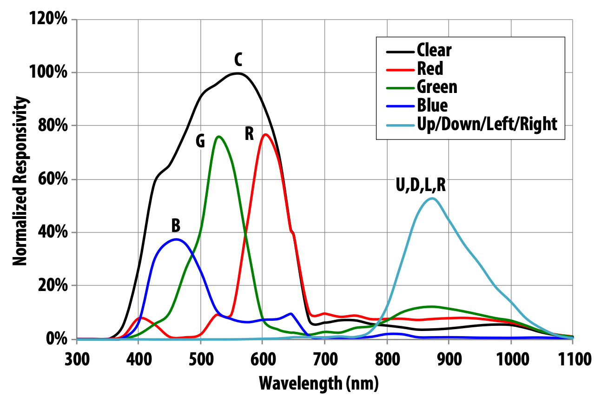

# Avago APDS-9960 Gesture Sensor

The APDS-9960 is an I2C device with advanced Gesture detection, Proximity detection, Digital Ambient Light Sense (ALS) and Color Sense (RGBC). It incorporates an IR LED and factory-calibrated LED driver.

##  Gesture detection
Gesture detection utilizes four directional photodiodes to
sense reflected IR energy (sourced by the integrated LED)
to convert physical motion information (i.e. velocity, direction and distance) to a digital information. The architecture of the gesture engine features automatic activation
(based on Proximity engine results), ambient light subtraction, cross-talk cancelation, dual 8-bit data converters, power saving inter-conversion delay, 32-dataset FIFO, and interrupt driven I2C communication. The gesture engine
accommodates a wide range of mobile device gesturing
requirements: simple UP-DOWN-RIGHT-LEFT gestures or
more complex gestures can be accurately sensed.



## Code

```py
import machine
from time import sleep_ms
from uPy_APDS9960.apds9960LITE import APDS9960LITE

#Init I2C Buss on RP2040
sda=machine.Pin(12)
scl=machine.Pin(13)
i2c =  machine.I2C(0,scl=scl, sda=sda)

apds9960=APDS9960LITE(i2c)      # Enable sensor
apds9960.prox.enableSensor()    # Enable Proximit sensing

while True:
        sleep_ms(25) # wait for readout to be ready
        print(apds9960.prox.proximityLevel)   #Print the proximity value
```

Returns

```
0 1 1 1 1 1 0 1 1 2 2 1 1 1 1 1 0 
```

## Ambient Light

```py
# from https://github.com/rlangoy/uPy_APDS9960
import machine
from time import sleep,sleep_ms
from APDS9960LITE import APDS9960LITE

#Init I2C Buss on RP2040
sda=machine.Pin(12)
scl=machine.Pin(13)
i2c=machine.I2C(0, sda=sda, scl=scl, freq=400000)

print(i2c)
# create the driver
apds9960=APDS9960LITE(i2c)
apds9960.als.enableSensor()           # Enable Light sensor
sleep_ms(25)                          # Wait for readout to be ready

#apds9960.powerOn(True)
#print(apds9960.statusRegister())

while True:
    print(apds9960.als.ambientLightLevel, ' ', end='')
    sleep(.1)
```

returns

```
1  1  0  0  0  0  0  0  0  0  1  1  1  4  8  10  10  10  12  16  17  19  19  20  21  21  22  25  27  30  33  35  36  37  38  33  33  34  34  34  34  34  35  36  36  38  39  40  38  37  38  40  42  45  48  49  55  61  66  73  76  76  82  93  109  132  156  169  171  173  173  171  164  160  169  165  162  162  164  163  159  158  152  148  148  145  141  135  122  106  96  101  108  89  62  48  33  20  10  5  3  1  0  0  0  0  0  0  0  1  2  4  8  14  26  45  65  91  110  121  124  127  132  150  191  225  244  244  254  288  295  243  219  259  299  287  204  99  31  10  2  1  1  1  0
```

## Reading RGB


```py
while True:
    print(apds9960.als.ambientLightLevel,'', end='')
    print(apds9960.als.redLightLevel,'', end='')
    print(apds9960.als.greenLightLevel,'', end='')
    print(apds9960.als.blueLightLevel)
    sleep(.1)
```

```
1 0 0 0
2 0 0 1
4 1 0 1
8 3 2 2
17 6 5 5
28 14 10 8
38 19 12 11
37 27 15 12
38 30 15 12
43 29 15 14
35 22 11 11
26 17 9 7
18 12 6 5
13 7 4 3
9 4 3 2
```

## References

### Using TinyML
https://www.hackster.io/mjrobot/tinyml-motion-recognition-using-raspberry-pi-pico-6b6071?f=1

### Datasheet
https://cdn.sparkfun.com/assets/learn_tutorials/3/2/1/Avago-APDS-9960-datasheet.pdf

### Other References
https://robojax.com/learn/arduino/?vid=robojax-gesture-APDS9960

https://upy-apds9960.readthedocs.io/en/latest/#

https://www.youtube.com/watch?v=wH9HpP9bKwE

https://github.com/rlangoy/uPy_APDS9960/blob/master/uPy_APDS9960/apds9960LITE.py
