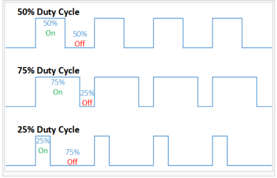
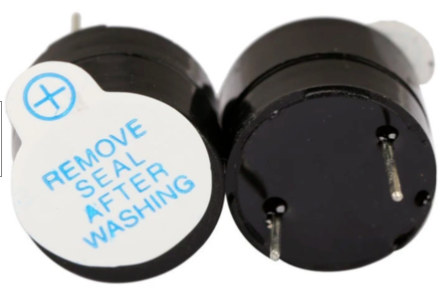
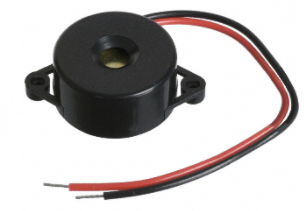

# Introduction to Sound and Music in MicroPython

## How Microcontrollers Generate Sound

Microcontrollers are really great at generating digital outputs on their GPIO pins.  These digital signals that quickly switch between zero and a positive voltage like 3.3 or 5 volts.  However, they are not designed to create "analog" output of a continuous varying voltage.  However, we can use a technique called "Pulse Width Modulation" to simulate the various frequencies of sound using digital only outputs.

[Pulse Width Modulation](https://en.wikipedia.org/wiki/Pulse-width_modulation) is the process of changing not the height of a electrical signal, but the width between the pulses of digital signals.  By changing the distance of the spaces between the digital signals we can generate a signal that will sound like it has a higher or lower frequency or pitch.

MicroPython provides a powerful library of tools for you to easily generate pulses of different shapes.  This is called the PWM library.  Will will use this in our sound and music programs.  Here is a sample of how this is called in our code:

## Duty Cycle
The Duty Cycle is what percent of time a pulse is high.



For working with sound, we want to generate smooth sound waves that are on 1/2 of the time and off 1/2 of the time.  So our duty cycles will be set to be 50%.  On the Raspberry Pi Pico we can achieve this by the following function:

```
speaker.duty_u16(1000)
```

When we are done playing a tone, we must always explicitly turn the duty cycle back to 0.

```
speaker.duty_u16(0)
```

If we forget to add this line, the tone will continue to play despite the main program stopping.  This shows you that the part of the chip that generates the tone pulses is an independent processor that is not dependant on the main program running!

```py
from machine import Pin, PWM
from utime import sleep
```

Note that we will also need to pause between notes, so will use the sleep library to pause execution of our sound generation.

## Connecting a Sound Device

There are several different ways that you can connect a sound device to you MicroController.  Here are three options:

1. **Buzzers** - These are small inexpensive devices that can mount directly on your breadboard.
2. **Piezoelectric Speaker** - [Wikipedia Page on Piezoelectric Speaker](https://en.wikipedia.org/wiki/Piezoelectric_speaker)
2. **Speaker** - A magnetic speaker with our without an amplifier is another way to hear sound.  You can also purchase a small amplifier to increase the volume.
4. **Amplifier** - For about $1.20 you can purchase a small amplifier for your speaker. [eBay LM386 DC 5V-12V Mini Micro Audio Amplifier Module Board](https://www.ebay.com/itm/LM386-DC-5V-12V-Mini-Micro-Audio-Amplifier-Module-Board-Mono-AMP-ModuleEP-I/133596864305)




## References

https://electronics.stackexchange.com/questions/288930/what-is-the-difference-between-a-buzzer-and-a-speaker-and-are-there-any-other-ba