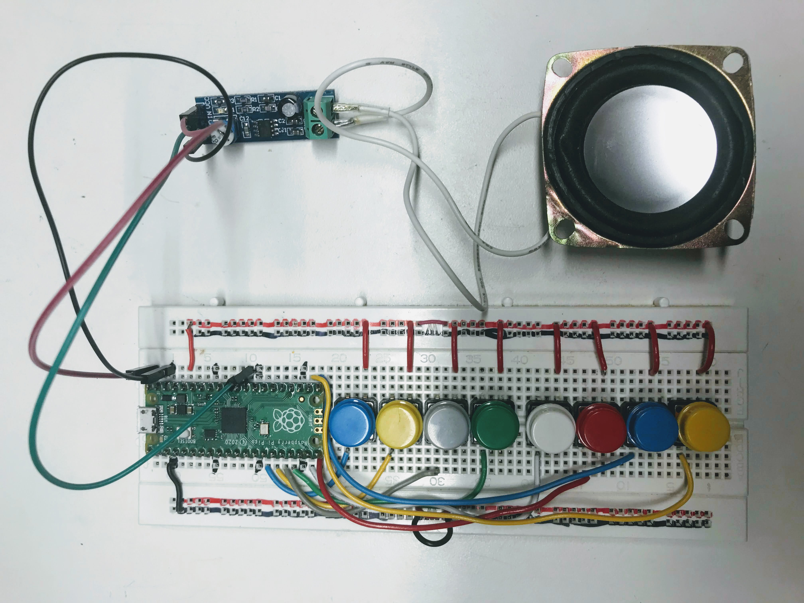

# Eight Key Piano

In this lab we wire up eight momentary press buttons so that when each one is pressed it will play a different note.

<iframe width="560" height="315" src="https://www.youtube.com/embed/IeHaYR17zcQ" title="YouTube video player" frameborder="0" allow="accelerometer; autoplay; clipboard-write; encrypted-media; gyroscope; picture-in-picture" allowfullscreen></iframe>

To create this project, you will need the following parts:

1. A Raspberry Pi Pico
2. A standard size breadboard or two 1/2 breadboards
3. 8 momentary press buttons
4. A speaker or a [Piezo buzzer](https://en.wikipedia.org/wiki/Piezoelectric_speaker)
5. An optional sound amplifier such as the [LM386 DC 5V-12V Mini Micro Audio Amplifier](https://www.ebay.com/itm/234012505949?hash=item367c3b775d:g:sPkAAOSwtoVbOFbf) which can be purchased on e-bay for under $2 USD.  If you are working in a quiet room you may not need the amplifier.



Each "key" is a momentary press button that is wired up between a GPIO pin and the +3.3 volt rail on the breadboard connected to [3V3(OUT) pin](../getting-started/02-pi-pico/#pico-pinout).  We do not need to use any resistors to pull the signals low since we configure the pins to be inputs with the PULL_DOWN resistor like this:

```py
button_pin_1 = machine.Pin(10, machine.Pin.IN, machine.Pin.PULL_DOWN)
```

## The Play Tone Functions

We will use two Python functions, one for playing a tone of a given frequency and one for turning off the sound.

```py
def playtone(frequency):
    speaker.duty_u16(1000) # turn the PWM duty to 50%
    speaker.freq(frequency)
    builtin_led.high() # turn builtin LED on

def bequiet():
    speaker.duty_u16(0) # turn off the speaker PWM
    builtin_led.low() # turn builtin LED off
```

We will also use the ```.value()``` method on each pin to detect if it is HIGH (1) like this:

```py
if button_pin_1.value() == 1:
        playtone(220) # A3
```

We will be playing "notes" generating square waves with various frequencies from our lowest note of A3 at 220 Hz up to A4 at 440 Hz.

## Sample Code

```py
# play a tone durning button down
from machine import Pin, PWM
from utime import sleep, ticks_ms

SPEAKER_PIN = 22 # pass through a speaker and tie the other end to GND
speaker = PWM(Pin(SPEAKER_PIN))

builtin_led = machine.Pin(25, Pin.OUT)

# Connect these GP pins through a button to the +3.3 volt rail
button_pin_1 = machine.Pin(10, machine.Pin.IN, machine.Pin.PULL_DOWN)
button_pin_2 = machine.Pin(11, machine.Pin.IN, machine.Pin.PULL_DOWN)
button_pin_3 = machine.Pin(12, machine.Pin.IN, machine.Pin.PULL_DOWN)
button_pin_4 = machine.Pin(13, machine.Pin.IN, machine.Pin.PULL_DOWN)
button_pin_5 = machine.Pin(14, machine.Pin.IN, machine.Pin.PULL_DOWN)
button_pin_6 = machine.Pin(15, machine.Pin.IN, machine.Pin.PULL_DOWN)
button_pin_7 = machine.Pin(16, machine.Pin.IN, machine.Pin.PULL_DOWN)
button_pin_8 = machine.Pin(17, machine.Pin.IN, machine.Pin.PULL_DOWN)

def playtone(frequency):
    speaker.duty_u16(1000) # turn the PWM duty to 50%
    speaker.freq(frequency)
    builtin_led.high() # turn builtin LED on

def bequiet():
    speaker.duty_u16(0) # turn off the speaker PWM
    builtin_led.low() # turn builtin LED off

while True:
    if   button_pin_1.value() == 1:
        playtone(220) # A3
    elif button_pin_2.value() == 1:
        playtone(247) # B3
    elif button_pin_3.value() == 1:
        playtone(262) # C4
    elif button_pin_4.value() == 1:
        playtone(294) # D4
    elif button_pin_5.value() == 1:
        playtone(330) # E4
    elif button_pin_6.value() == 1:
        playtone(349) # F4
    elif button_pin_7.value() == 1:
        playtone(392) # G4
    elif button_pin_8.value() == 1:
        playtone(440) # A4
    else:
        bequiet()
```

## Exercises

1. Rewrite the code above using lists for the pin numbers and the notes.
2. Try different notes with other scales.
3. Add another button to change the "octave" of the notes.
4. Add a display to show the notes as they are being played.
5. Print the time each note is being pressed as well as the length of the pauses between the notes.
6. Write the notes to a recording file.
7. Add a menu system so you can do things like start a new song recording, save a recording and playback a recording.
8. Eight keys are not enough for many songs.  Use two full-size breadboards to expand the number of keys on your piano.
9. Look into getting a MIDI keyboard such as the 32-key $40 [MIDIPLUS AKM320 USB MIDI Keyboard Controller](https://www.amazon.com/midiplus-32-Key-Midi-Controller-AKM320/dp/B00VHKMK64/ref=bmx_dp_n4il8m3n_37/135-5614730-7499827?th=1)
10. Read this blog about running MIDI on the Pico: [MIDI, MicroPython and the Raspberry Pi Pico](https://diyelectromusic.wordpress.com/2021/01/23/midi-micropython-and-the-raspberry-pi-pico/)