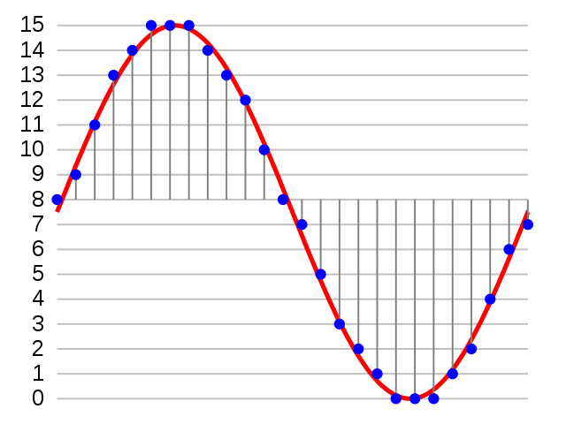

# Playing an Audio File

<iframe width="560" height="315" src="https://www.youtube.com/embed/Ax7XAhnwQ24" title="YouTube video player" frameborder="0" allow="accelerometer; autoplay; clipboard-write; encrypted-media; gyroscope; picture-in-picture" allowfullscreen></iframe>

!!! Note
    This lesson is still a work in progress.  The wavePlayer is in an early draft form and has unpredictable interactions with other components.  See the wav file test results section below.  We also are having problems when different GPIO pins are used.  If you stick to pins for GPIO 2 and 3 for the two channels the test run OK.

## Playing Sounds on The RP2040 Chip

Although we can play tones of various pitches on the PR2040 using the PMW to generate square waves, the quality of this sound is not close to high-fidelity sound like you would expect in a personal MP3 audio player.

In this lesson we will demonstrate how to play a high-quality audio files that are stored on the two megabytes of non-volatile static memory of the Pico.  According to the specification of the [Raspberry Pi Pico](https://www.raspberrypi.com/products/raspberry-pi-pico/specifications/), the system comes with 2MB on-board QSPI Flash that we can use to store sound files.  By combining our Pico with an SD card reader we can also play many sounds and even full-length music and full albums.

## Background on Audio Encoding



Audio files are encoded in many formats.  For this lab there are two key concepts to understand:

1. The [Sampling Rate](https://en.wikipedia.org/wiki/Sampling_(signal_processing)#Sampling_rate) which is how frequently an audio signal is sampled.  The more frequently we sample (up to 41K per second) the higher the fidelity of the recording.  The downside is that the audio file takes more space.
2. The [audio bit depth](https://en.wikipedia.org/wiki/Audio_bit_depth) is how many bits we used to encode the amplitude of the sound.

For our labs, we will be using mono files (not stereo) a sampling rate of 8,000 samples per second (8K Hz) and a sampling rate of 16-bit depth.  This is a good compromise between smaller size and sound fidelity in typical robots.

Our robots typically will play a short 1-second sound to tell us they are performing an action like stopping, backing up or turning.  This one-second 8K Hz WAV file will be about 20K.  Our flash budget for the Raspberry Pi Pico is 2M, so we can easily store 10 sound effects in 200K or 1/10 of our available flash memory.  We can also add a SD card if we need more flash memory.

We will be using standard .WAV files with [Pulse Code Modulation Encoding](https://en.wikipedia.org/wiki/Pulse-code_modulation) in .WAV files.  WAV files do take more space than compressed MP3 files, but they are easier to play because the decoding steps are trivial for a microcontroller to perform.

## Overall Architecture

1. We will be reading .wav files from the MicroPython non-volatile flash memory or an SD card.
2. We will be using the wave.py module to read the .wav files
3. We will be using the myPMW.py, chunk.py and myDMA.py modules to stream the data from the pwm files to the PWM controllers
4. The metadata from the .wav files is used to change the sampling frequency of the .wav player

## Connections

Some of this documentation was take from [Dan Perron's Pico Audio GitHub Repo](https://github.com/danjperron/PicoAudioPWM).

In these tests we used GPIO pins 2 and 3 to drive the left and right channels of audio that are sent to a stereo amplifier.  You can use both an amplifier or head phone with a 1K resistor in series on the pins to limit the current from the 3.3v output signals.

The myPWM subclass set the maximum count to 255 (8 bits)  or 1023(10bits) at a frequency 
around 122.5KHz.

The PWM is now on 10 bits (0..1023)

The myDMA class allows to use direct memory access to transfer each frame at the current
sample rate.

We will need to install the wave.py and chunk.py from [Jokey GitHub Awesome MicroPython Repo](https://github.com/joeky888/awesome-micropython-lib/tree/master/Audio) on root file system or the /lib folder on the pico file system.

Don't forget to increase the SPI clock up to 3Mhz. (TODO not sure what this means)

The following documentation was take from Daniel Perron's Github page.

1. We set the PWM to a range of 255 at 122Khz
2. We read the wave file using the class ```wave.py``` which will set the 
       sample rate and read the audio data by chunk
3. Each chunk is converted to 16 bit signed to unsigned char with the middle at 128, (512 for 10 bits)
1. We wait for the DMA to be completed.  On first it will be anyway.
2. The converted chunk is then pass to the DMA to be transfer at the sample rate using one of build in timer
3. Go on step 2 until is done.

## Steps to test playing a wav file

### Clone the Pico Audio PWM GitHub Repository
```sh
git clone https://github.com/danjperron/PicoAudioPWM
cd PicoAudioPWM
```

## Download some test robot wav files

The following GitHub location:

[https://github.com/CoderDojoTC/robot-media/tree/master/wav-8k](https://github.com/CoderDojoTC/robot-media/tree/master/wav-8k)

contains a set of 8K Hz 16 bit robot sounds that you can use with your robot.

## Converting .MP3 to .WAV files

This software only currently support playing .wav files since it is easy to convert these files into a format that can be played. WAV files store uncompressed audio, so they are larger than MP3 files.  Wav files are simple ways to store sound patterns.  MP3 files are much more complex and require complex algorithms to convert into sound outputs.

 The usual bitstream encoding is the linear pulse-code modulation (LPCM) format.

If you have just a few MP3 files, can use the following web-site to convert MP3 files into wave files:

[Cloud Convert Service that Converts MP3 to WAV files](https://cloudconvert.com/mp3-to-wav)

The [next lab](09-converting-mp3-to-wav.md) shows you how to convert an entire folder of MP3 files to 8K Hz 16-bit WAV files using a shell script.

## Copy Sound Files to the Pico

Your pico has 2MB of static memory.  A typical robot sound effect you want to play when you bump into and object will play for around 1 second.  You can copy many sound effect files to the pico file system and play them.  Some IDEs may allow you to do this or you can use the rshell program.

Here is an example of using the [rshell](../advanced-labs/11-rshell.md) program to copy a directory of wav files to the pico.  Lines that start with pc$ are commands that you type into your PC or MAC's terminal.  Lines that start with rs$ are commands that you type into the rshell.

```sh
# list the devices (only works on Mac and UNIX)
pc$ ls /dev/cu.modem*
# start the rshell
pc$ rshell -p /dev/cu.modem*
# change the name of the device to be "pico"
rs$ echo 'name="pico"' > /pyboard/board.py
# exit from rshell - can also use exit
CONTROL-C
# reconnect with the rshell
$pc rshell -p /dev/cu.modem*
# go into the /pico file systems
$rs cd /pico
# create a directory for all our sound files
mkdir sounds
# copy files from hour PC's home ~/tmp/sounds dir to the pico
rs$ cp ~/tmp/sounds/*.wav /pico/sounds
rs$ ls /pico/sounds
```

## Listing the Wave Files

After you have a list of Wave files loaded you can verify them by using the os listdir() function.

```py
import os

waveFolder= "/sounds"
wavelist = []

# get a list of .wav files
for i in os.listdir(waveFolder):
    if i.find(".wav")>=0:
        wavelist.append(waveFolder+"/"+i)
    elif i.find(".WAV")>=0:
        wavelist.append(waveFolder+"/"+i)
            
if not wavelist :
    print("Warning NO '.wav' files")
else:
    for i in wavelist:
        print(i)
```

Sample console output

```
/sounds/cylon-attention.wav
/sounds/cylon-by-your-command.wav
/sounds/cylon-excellent.wav
/sounds/cylon-eye-scanner.wav
/sounds/cylon-see-that-the-humans.wav
/sounds/cylon-those-are-not-the-sounds.wav
```

## Checking the WAV File Format

There is a standard Python module called ```wave.py`` that reads the .wav files and shows the metadata for the file.  Wave files come in many formats, single channel, stereo and different bit rates.  The wave player can show us all this data that describes the wave file.

The report shows you how to use fixed-width formatting since the file names and data should fit in columns to make it easier to read.

```py
import os
import wave

waveFolder= "/sounds"
wavelist = []

# get a list of .wav files
for i in os.listdir(waveFolder):
    if i.find(".wav")>=0:
        wavelist.append(waveFolder+"/"+i)
    elif i.find(".WAV")>=0:
        wavelist.append(waveFolder+"/"+i)
            
if not wavelist :
    print("Warning NO '.wav' files")
else:
    print("{0:<45}".format('File Path'), 'Frame Rate  Width Chans Frames')
    for filename in wavelist:
        f = wave.open(filename,'rb')
        # the format string "{0:<50}" says print left justified from chars 0 to 50 in a fixed with string
        print("{0:<50}".format(filename),
              "{0:>5}".format(f.getframerate()),
              "{0:>5}".format(f.getsampwidth()),
              "{0:>6}".format(f.getnchannels()),
              "{0:>6}".format(f.getnframes())
              )
```

Sample Response

```
File Path                                     Frame Rate  Width Chans Frames
/sounds/cylon-attention.wav                         8000     1      1   6399
/sounds/cylon-by-your-command.wav                  11025     1      1  12583
/sounds/cylon-excellent.wav                        22050     1      1  48736
/sounds/cylon-eye-scanner.wav                      16000     2      2  24768
/sounds/cylon-see-that-the-humans.wav              11025     1      1  30743
/sounds/cylon-those-are-not-the-sounds.wav         22050     1      1  64137
```

## Adding an Interrupt

If you halt the RP2040 while it is playing a sound, the independent PWM controllers will continue to generate sound.  In order to shut the independent PWM controllers, an interrupt controller system must be used to cleanly disable all the sound.  Here is an example of this using a try/except block of code.

```py
import os as uos
from wavePlayer import wavePlayer
player = wavePlayer()

try:
    while True:
        # repeat this over and over until the keyboard shuts down the circuit
        player.play('/sounds/cylon-eye-scanner.wav')
except KeyboardInterrupt:
    player.stop()
    print("wave player terminated")
```

## Playing the Same Sound Repeatedly

```py
import os as uos
from wavePlayer import wavePlayer
player = wavePlayer()

try:
    while True:
        player.play('/sounds/cylon-eye-scanner.wav')
except KeyboardInterrupt:
    player.stop()
    print("wave player terminated")
```

## Downloading the Audio Libraries

Both the wave.py and the chunck.py files are here:

https://github.com/joeky888/awesome-micropython-lib/tree/master/Audio

## References

1. [Daniel Perron](https://github.com/danjperron/PicoAudioPWM)
2. [Wikipedia page for Wave File](https://en.wikipedia.org/wiki/WAV)c
3. [Web-Based Audio Conversion Service Convertio](https://convertio.co/audio-converter/)
4. [Wikipedia page for Audio Interchange File Format](https://en.wikipedia.org/wiki/Audio_Interchange_File_Format)
5. [Wikipedia page for Pulse-code Modulation](https://en.wikipedia.org/wiki/Pulse-code_modulation)