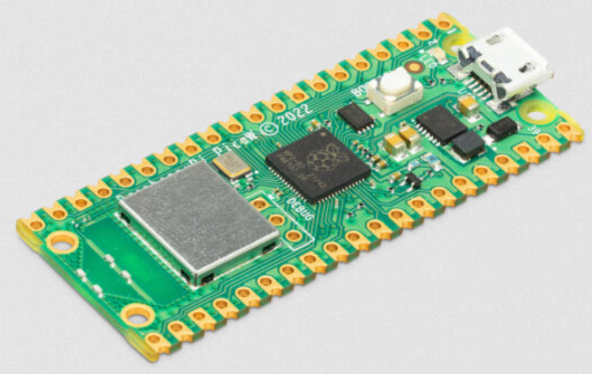

# Introduction to Networking with MicroPython

These lessons are designed to give our students an understanding of how wireless communications work with MicroPython.

## Raspberry Pi Pico W

One June 30th, 2022 the [Raspberry Pi Foundation announced](https://www.raspberrypi.com/news/raspberry-pi-pico-w-your-6-iot-platform/) the availability of the Raspberry Pi Pico W.  This $6 microprocessor now supports WiFi and with a software upgrade it may soon support Bluetooth.

The Pico W supports 2.4 Ghz 802.11n wireless networking.  For MicroPython, we can use a MicroPython library built around the [lwip](https://savannah.nongnu.org/projects/lwip/) TCP/IP stack.  This stack is accessible using the MicroPython [network](https://docs.micropython.org/en/latest/library/network.html#) functions.

The WiFi chip used is the [Infineon CYW43439](https://www.infineon.com/cms/en/product/wireless-connectivity/airoc-wi-fi-plus-bluetooth-combos/cyw43439/) chip.  This chip also uses an ARM architecture and has extensive support for Bluetooth wireless communication.

You can read more about the capabilities of the WiFi/Bluetooth chip by reading the [Infineon CYW43439 Datasheet](https://www.infineon.com/dgdl/Infineon-CYW43439-Single-Chip-IEEE-802.11-b-g-n-MAC-PHY-Radio-with-Integrated-Bluetooth-5.0-Compliance-AdditionalTechnicalInformation-v03_00-EN.pdf?fileId=8ac78c8c7ddc01d7017ddd033d78594d).  I found it interesting that the CYW43439 chip has 512KB of SRAM - almost double what the RP2040 chip contains!

## ESP32 Wireless

We have not integrated the ESP32 into our labs.  We suggest you try the following links:

[ESP32 MicroPython: Connecting to a WiFi Network on Tech Tutorials SX](https://techtutorialsx.com/2017/06/01/esp32-micropython-connecting-to-a-wifi-network/)

[MicroPython: Wi-Fi Manager with ESP32 (ESP8266 compatible) on Random Nerd Tutorials](https://randomnerdtutorials.com/micropython-wi-fi-manager-esp32-esp8266/)