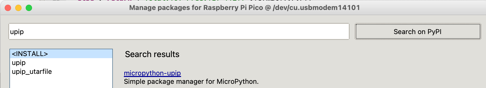
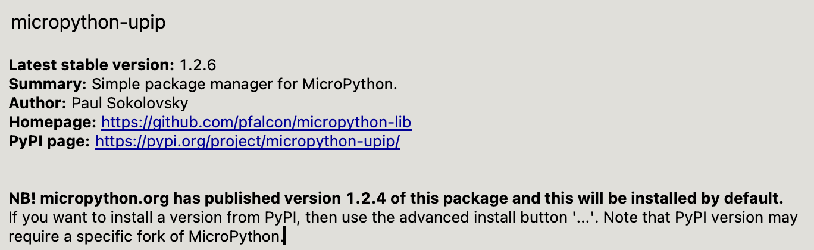

# MicroPython PIP (UPIP)

MicroPython also has a package manager called ```upip``` that can be run directly on the microcontroller.  This means that every time you get a new microcontroller, you can automatically download all the python packages you need directly from the Internet using a single python program after ```upip``` has been installed.

This also means that you don't need copies of these libraries installed on your local PC.

## Install UPIP From Thonny Package Manager

Go to the Thonny Tools -> Manage Packages... menu.  Type "upip" in the search field and click the **Search on PyPL** button:



The first search result will be for **micropython-upip".  Click on that link and you will see the details.



## Install A Package

The following program assumes that you have followed the steps in our [Connecting to WiFi](02-connecting-to-wifi/) and have a secrets.py file that have your WiFi network name (SSID) and password (PASSWORD).

```python
import upip
import network
import secrets
from utime import sleep, ticks_ms, ticks_diff

print('Connecting to WiFi Network Name:', secrets.SSID)
wlan = network.WLAN(network.STA_IF)
wlan.active(True)

start = ticks_ms() # start a millisecond counter

if not wlan.isconnected():
    wlan.connect(secrets.SSID, secrets.PASSWORD)
    print("Waiting for connection...")
    counter = 0
    while not wlan.isconnected():
        sleep(1)
        counter += 1
        print(counter, '.', sep='', end='', )

delta = ticks_diff(ticks_ms(), start)
print("Connect Time:", delta)

# This is the line you must modify for each package you want to install
# pystone is a CPU performance benchmarking tool that is easy to run to and test installation

start = ticks_ms()

upip.install("micropython-pystone_lowmem")

print("Download Time:", ticks_diff(ticks_ms(), start), milliseconds)
```

Results:

```
Connecting to WiFi Network Name: MY_NETWORK_NAME
Waiting for connection...
1.2.3.4.Connect Time: 4641
Installing to: /lib/
Warning: micropython.org SSL certificate is not validated
Installing micropython-pystone_lowmem 3.4.2.post4 from https://micropython.org/pi/pystone_lowmem/pystone_lowmem-3.4.2.post4.tar.gz
Download Time: 4918 milliseconds
```


## Testing Your Libreary

```py
import pystone_lowmem
pystone_lowmem.main()
```

Results:

```
Pystone(1.2) time for 500 passes = 410ms
This machine benchmarks at 1219 pystones/second
```