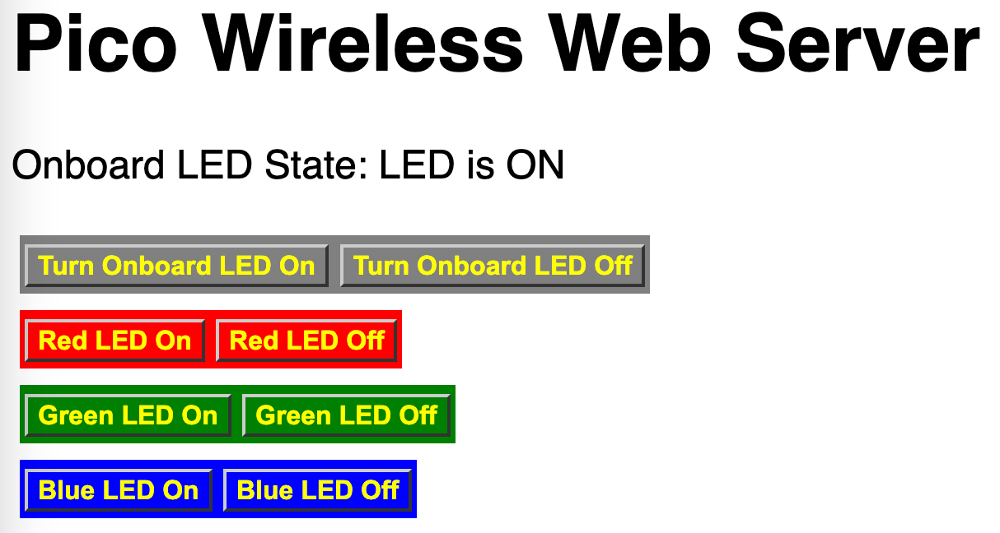

# Web Server NeoPixel RGB 



## Sample Code with CSS

```python
# Code taken from https://www.cnx-software.com/2022/07/03/getting-started-with-wifi-on-raspberry-pi-pico-w-board/
from machine import Pin
from neopixel import NeoPixel
import network
import socket
from time import sleep
import secrets

NEOPIXEL_PIN = 0
NUMBER_PIXELS = 30
PERCENT_COLOR_WHEEL = round(255/NUMBER_PIXELS)

# setup
strip = NeoPixel(machine.Pin(NEOPIXEL_PIN), NUMBER_PIXELS)

red = (255,0,0)
green = (0,255,0)
blue = (0,0,255)
off = (0,0,0)

def set_color(color):
    for i in range(0, NUMBER_PIXELS):
        strip[i] = color
        strip.write()
        
# Select the onboard LED
led = machine.Pin("LED", machine.Pin.OUT)

wlan = network.WLAN(network.STA_IF)
wlan.active(True)
wlan.connect(secrets.SSID, secrets.PASSWORD)
stateis = "LED is OFF"

html = """<!DOCTYPE html>
<html>
   <head>
     <title>Web Server On Pico W </title>
     <style>
        body {
            font-size:24px;
            font-family:'Helvetica'
        }
        
        .button-row {
            display: inline-block;
            padding: 2px 3px 6px 3px;
            margin: 5px;
        }
        
        a:visited {
          color: yellow;
          background-color: transparent;
          text-decoration: none;
        }
        
        a:hover {
          color: orange;
          background-color: transparent;
          text-decoration: none;
        }

        .button {
          font: bold 16px Arial;
          text-decoration: none;
          padding: 2px 6px 2px 6px;
          border-top: 2px solid #CCCCCC;
          border-right: 2px solid #333333;
          border-bottom: 2px solid #333333;
          border-left: 2px solid #CCCCCC;
        }
     </style>
   </head>
  <body>
      <h1>Pico Wireless Web Server</h1>
      <p>Onboard LED State: %s</p>

      
      <div class="buttons">
      
          <span class="button-row" style="background-color:gray">
              <a href="/light/on" class="button">Turn Onboard LED On</a>
              <a href="/light/off" class="button">Turn Onboard LED Off</a>
          </span><br/>
          
          <span class="button-row" style="background-color:red">
             <a href="/led/red/on" class="button">Red LED On</a>
             <a href="/led/red/off" class="button">Red LED Off</a>
          </span><br/>
                 
          <span class="button-row" style="background-color:green">
              <a href="/led/green/on" class="button">Green LED On</a>
              <a href="/led/green/off" class="button">Green LED Off</a>
          </span><br/>
          
          <span class="button-row" style="background-color:blue">
              <a href="/led/blue/on" class="button">Blue LED On</a>
              <a href="/led/blue/off" class="button">Blue LED Off</a>
          </span>
          
        </div>
  </body>
</html>
"""

# Wait for connect or fail
max_wait = 10
while max_wait > 0:
  if wlan.status() < 0 or wlan.status() >= 3:
    break
  max_wait -= 1
  print('waiting for connection...')
  sleep(1)
  led.toggle()

# Handle connection error
if wlan.status() != 3:
  raise RuntimeError('network connection failed')
else:
  print('We are connected to WiFI access point:', secrets.SSID)
  status = wlan.ifconfig()
  print( 'The IP address of the pico W is:', status[0] )

# Open socket
addr = socket.getaddrinfo('0.0.0.0', 80)[0][-1]
# print('addr:', addr)

s = socket.socket()
# this prevents the "OSError: [Errno 98] EADDRINUSE" error for repeated tests
s.setsockopt(socket.SOL_SOCKET, socket.SO_REUSEADDR, 1)
# print('Got a sockert.  s:', s)

#if not addr:

# print('going to run bind to addr on the socket')
s.bind(addr)

# print('going to run listen(1) on socket')
s.listen(1)

# print('listening on', addr)

# Listen for connections
while True:
  try:
    cl, addr = s.accept()
    # print('client connected from', addr)
    request = cl.recv(1024)
    # print(request)
    request = str(request)
    led_on = request.find('/light/on')
    led_off = request.find('/light/off')
    
    red_on = request.find('/led/red/on')
    red_off = request.find('/led/red/off')
    
    green_on = request.find('/led/green/on')
    green_off = request.find('/led/green/off')
    
    blue_on = request.find('/led/blue/on')
    blue_off = request.find('/led/blue/off')

    # print( 'led on = ' + str(led_on))
    # print( 'led off = ' + str(led_off))

    if led_on == 6:
      print("led on")
      led.on()
      stateis = "LED is ON"

    if led_off == 6:
        print("led off")
        led.off()
        stateis = "LED is OFF"
    
    if red_on == 6:
        print("red on")
        set_color(red)
    if red_off == 6:
        print("red off")
        set_color(off)

    if green_on == 6:
        print("green on")
        set_color(green)
    if green_off == 6:
        print("green off")
        set_color(off)

    if blue_on == 6:
        print("blue on")
        set_color(blue)
    if blue_off == 6:
        print("blue off")
        set_color(off)
    
    # generate the we page with the stateis as a parameter
    response = html % stateis
    cl.send('HTTP/1.0 200 OK\r\nContent-type: text/html\r\n\r\n')
    cl.send(response)
    cl.close()

  except OSError as e:
    cl.close()
    s.close()
    print('connection closed')
```

## References

Clear Fix Floating Boxes Example

https://www.w3schools.com/css/tryit.asp?filename=trycss_float_boxes

```html
<style>
* {
  box-sizing: border-box;
}

.box {
  float: left;
  width: 33.33%;
  padding: 30px 20px;
}

.clearfix::after {
  content: "";
  clear: both;
  display: table;
}
</style>
</head>
<body>

  <h2>Grid of Boxes</h2>
  <p>Float boxes side by side:</p>

  <div class="clearfix">
    <div class="box" style="background-color:silver">
    <p>Some text inside the box.</p>
    </div>
    <div class="box" style="background-color:gray">
    <p>Some text inside the box.</p>
    </div>
  </div>
```