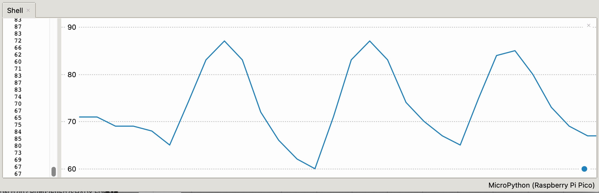

# Get the Weather Forecast

This demo uses the free web service [Open Weather Map](http://openweathermap.org).

The Open Weather Map service returns the predicted temperatures and conditions (sun, cloudy, rain etc.) for three hour intervals for the next 40 intervals at your location.

You can see this using the UNIX curl command:

```sh
curl 'hhttp://api.openweathermap.org/data/2.5/forecast?units=imperial&id=5037649&appid=f2b1...'
```

In this example, I am asking it to use US standard Fahrenheit (imperial units) for the city with id 5037649 which is Minneapolis.  You can use the Open Weather site to find the id for your city or specify the long and lat of the point you want to get weather forecasts for.  You can also use the [GeoNames](https://www.geonames.org/5037649/minneapolis.html) to find your city ID number.

## How to Use the Open Weather Map API

To use this service, you must register and get an API key.  You then put your key in the secrets.py file:

Content of secrets.py
```python
appid='f2b1...'
```

The secrets.py file is then imported into your program.  Make sure to put secrets.py into your .gitignore file so it will not be checked into your public GitHub repo.

The URL for the service is then created by concatenating the base URL, the city location ID and the application id:

```python
base = 'http://api.openweathermap.org/data/2.5/forecast?units=imperial&'
location = '5037649' # GeoNames ID for Minneapolis in Minnesota, USA
url = base + 'id=' + location + '&appid=' + secrets.appid
```

## Parsing the JSON file

## Sample Output

Here is the output on the Thonny shell of the first 16 temperature values:


## Plotting the Forecast with Thonny Plot



## Sample Code

```python
import network
import secrets
import urequests
from utime import sleep, ticks_ms, ticks_diff

print('Connecting to WiFi Network Name:', secrets.SSID)
wlan = network.WLAN(network.STA_IF)
wlan.active(True)

start = ticks_ms() # start a millisecond counter

if not wlan.isconnected():
    wlan.connect(secrets.SSID, secrets.PASSWORD)
    print("Waiting for connection...")
    counter = 0
    while not wlan.isconnected():
        sleep(1)
        print(counter, '.', sep='', end='', )
        counter += 1

delta = ticks_diff(ticks_ms(), start)
print("Connect Time:", delta, 'milliseconds')
print("IP Address:", wlan.ifconfig()[0])

base = 'http://api.openweathermap.org/data/2.5/forecast?units=imperial&'
location = '5037649' # twin cities
url = base + 'id=' + location + '&appid=' + secrets.appid

weather = urequests.get(url).json()
print('City:', weather['city']['name'])
print('Timezone:', weather['city']['timezone'])

max_times = 16
# for i in range(0, 39):
for i in range(0, max_times):
    print(weather['list'][i]['dt_txt'][5:13], ' ', sep='', end='')
print()
for i in range(0, max_times):    
    print(round(weather['list'][i]['main']['temp']), '      ', end='')
    # print('feels like:', weather['list'][i]['main']['feels_like'])
    # print(weather['list'][i]['weather'][0]['description'])
    # print(weather['list'][i]['dt_txt'])
    
# print(weather)
```

## Displaying Predicted Temperatures in a Thonny Plot

Thonny has a [Plot object](https://github.com/thonny/thonny/blob/707e69ec3a567df5f82205c5a2ae0d79f186ed25/thonny/plugins/help/plotter.rst) that you can use to display the relative temperature for the next 40 3-hour cycles.

To do this, we only need to print out the temperatures each on a separate line:

```python
print()
for i in range(0, max_times):    
    print(round(weather['list'][i]['main']['temp']))
```