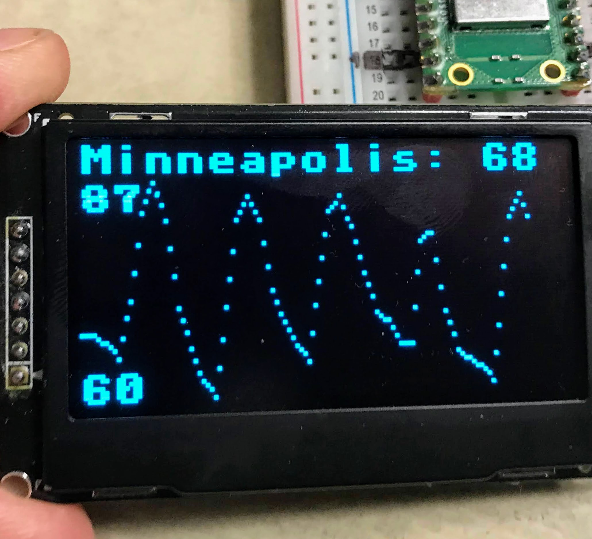

# Get Weather on an OLED Display



In this lesson we will use the Pico W to get a weather forecast from a web service and display the current and forecasted temperatures on a 128x64 OLED display.

## Calling the Weather API

We will use the same method as in the [previous lesson](./08-get-weather.md) to get the weather forecast.  However, in this lesson we will not just plot the temperature on the Thonny plot screen, we will use a OLED screen.

To do this we will need to write a function that will display the temperature data.  The function will display the current location city name, the current temperature, and then draw a plot of the next 40 3-hour intervals.

To achieve this we will need to scale the data to fit the display grid.  We will reserve the top 10 pixels for the city and current temp and then draw the plot on the remaining 54 pixel high and 128 pixel wide plot region.

To scale the data we will need to find the min and max temperatures.  These will also be displayed on the screen.  The scale is then the ratio of the graph height over the temperature range.  For example if the range of temperatures is 27 degrees and the height of the display is 54 we will need to scale the temperature vertically by 2.

The horizontal axis will go from 0 to 120.  Since we have 40 points, each point will occur every 3rd pixel. We can then look at the difference between the current point and the next point to interpolate the dots between the two points.

The math can be a little confusing since higher temperatures are closer to the top of the display, so they have a lower Y coordinate value.  Note the y_delta is subtracted from the next value:

```py
    y_delta = -round((y - y_next)/3) # a small positive or negative number for interpolation
```

```py
def display_weather():
    global weather, city, current_temp
    oled.fill(0)
    min = 120
    max = -50
    for i in range(0, 39):
        temp = round(weather['list'][i]['main']['temp'])
        if temp < min:
            min = temp
        if temp > max:
            max = temp
    min = round(min)
    max = round(max)
    temp_range_height = max - min
    graph_height = 54
    scale = graph_height/temp_range_height
    print('min/max/range/scale:', min, max, temp_range_height, scale)
    
    # display city name, current temp, min and max
    oled.text(city + ': ' + str(current_temp), 0, 0, 1)
    oled.text(str(min), 0, 57, 1) # bottom left corner
    oled.text(str(max), 0, 10, 1) # under top row
    
    max_points = 39
    
    # graph temps for the next n periods
    print('Date          Tmp TNx   Y  Y2  Del')
    for i in range(0, max_points):
        temp = round(weather['list'][i]['main']['temp'])
        x = i * 3 # scaled x
        y = 63 - round((temp - min)*scale)
        oled.pixel(x, y, 1)
        
        # now draw the next two points
        if i < max_points:
            temp_next = round(weather['list'][i+1]['main']['temp'])
            y_next = 63 - round((temp_next - min)*scale)
        y_delta = -round((y - y_next)/3) # a small positive or negative number
        
        # for debugging - fixed with columns with leading spaces
        print(weather['list'][i]['dt_txt'][0:13],
              '{: 3.3d}'.format(temp),
              '{: 3.3d}'.format(temp_next),
              '{: 3.3d}'.format(y),
              '{: 3.3d}'.format(y_next),
              '{: 3.3d}'.format(y_delta))
        
        # should be 1/3 of the way to the next point
        oled.pixel(x+1, y + y_delta, 1)
        # should be 2/3 of the way to the next point
        oled.pixel(x+2, y + 2*y_delta, 1)
    oled.show()
```

## The Main Loop

The main loop repeats forever, pausing every hour between updates.  It gets first calls the rest service,
extracts the city name and current temperature and then calls the display_weather() function using global variables for the JSON file, city and current temperature.

```python
while True:
    # globals: weather, city, current_temp
    weather = urequests.get(url).json()
    # print(weather)
    city = weather['city']['name']
    current_temp = round(weather['list'][0]['main']['temp'])
    display_weather()
    print('Going to sleep for one hour')
    sleep(3600) # sleep one hour
```

## Full Sample Code

```python
import network
import ssd1306
import secrets
import urequests
from utime import sleep, ticks_ms, ticks_diff

# startup

print('Connecting to WiFi Network Name:', secrets.SSID)
wlan = network.WLAN(network.STA_IF)
wlan.active(True)

WIDTH = 128
HEIGHT = 64
SCK=machine.Pin(2)
SDL=machine.Pin(3)
spi=machine.SPI(0,baudrate=100000,sck=SCK, mosi=SDL)
CS = machine.Pin(0)
DC = machine.Pin(1)
RES = machine.Pin(4)
oled = ssd1306.SSD1306_SPI(WIDTH, HEIGHT, spi, DC, RES, CS)
oled.poweron()

def display_startup(counter):
    oled.fill(0)
    oled.text('Running startup', 0, 10, 1)
    oled.text('Connecting to', 0, 20, 1)
    oled.text(secrets.SSID, 0, 30, 1)
    oled.text(str(counter), 0, 40, 1)
    oled.show()
    
def display_status(counter):
    oled.fill(0)
    # display the network name
    oled.text('n:' + secrets.SSID, 0, 0, 1)

    # display the connection time
    oled.text('t:', 0, 10, 1)
    oled.text(str(connection_time)+ ' ms', 15, 10, 1)
    oled.show()

def display_weather():
    global weather, city, current_temp
    oled.fill(0)
    min = 120
    max = -50
    for i in range(0, 39):
        temp = round(weather['list'][i]['main']['temp'])
        if temp < min:
            min = temp
        if temp > max:
            max = temp
    min = round(min)
    max = round(max)
    temp_range_height = max - min
    graph_height = 54
    scale = graph_height/temp_range_height
    print('min/max/range/scale:', min, max, temp_range_height, scale)
    
    # display city name, current temp, min and max
    oled.text(city + ': ' + str(current_temp), 0, 0, 1)
    oled.text(str(min), 0, 57, 1) # bottom left corner
    oled.text(str(max), 0, 10, 1) # under top row
    
    max_points = 39
    
    # graph temps for the next n periods
    print('Date          Tmp TNx   Y  Y2  Del')
    for i in range(0, max_points):
        temp = round(weather['list'][i]['main']['temp'])
        x = i * 3 # scaled x
        y = 63 - round((temp - min)*scale)
        oled.pixel(x, y, 1)
        
        # now draw the next two points
        if i < max_points:
            temp_next = round(weather['list'][i+1]['main']['temp'])
            y_next = 63 - round((temp_next - min)*scale)
        y_delta = -round((y - y_next)/3) # a small positive or negative number
        
        print(weather['list'][i]['dt_txt'][0:13],
              '{: 3.3d}'.format(temp),
              '{: 3.3d}'.format(temp_next),
              '{: 3.3d}'.format(y),
              '{: 3.3d}'.format(y_next),
              '{: 3.3d}'.format(y_delta))
        
        # should be 1/3 of the way to the next point
        oled.pixel(x+1, y + y_delta, 1)
        # should be 2/3 of the way to the next point
        oled.pixel(x+2, y + 2*y_delta, 1)
    oled.show()
    
start = ticks_ms() # start a millisecond counter

if not wlan.isconnected():
    wlan.connect(secrets.SSID, secrets.PASSWORD)
    print("Waiting for connection...")
    counter = 0
    while not wlan.isconnected():
        sleep(1)
        print(counter, '.', sep='', end='', )
        counter += 1
        display_startup(counter)

delta = ticks_diff(ticks_ms(), start)
#print("Connect Time:", delta, 'milliseconds')
#print("IP Address:", wlan.ifconfig()[0])

base = 'http://api.openweathermap.org/data/2.5/forecast?units=imperial&'
location = '5037649' # Minneapolis, MN USA
url = base + 'id=' + location + '&appid=' + secrets.appid
#print(url)

max_times = 39
#for i in range(0, max_times):    
    #print(' Temp: ', weather['list'][i]['main']['temp'])

while True:
    # globals: weather, city, current_temp
    weather = urequests.get(url).json()
    # print(weather)
    city = weather['city']['name']
    current_temp = round(weather['list'][0]['main']['temp'])
    display_weather()
    print('Going to sleep for one hour.')
    sleep(3600) # sleep one hour
```

## Sample Debugging

To allow you to see the math for the plotting and interpolation we have added a print that prints the temperatures and y coordinates in fixed with format.  Here is an example of this output:

```
Connecting to WiFi Network Name: anndan-2.4
min/max/range/scale: 60 87 27 2.0
Date           Tmp Tnx  Y  Y2  Del
2022-08-13 03  68  68  47  47   0
2022-08-13 06  68  68  47  47   0
2022-08-13 09  68  65  47  53   2
2022-08-13 12  65  72  53  39  -5
2022-08-13 15  72  83  39  17  -7
2022-08-13 18  83  87  17   9  -3
2022-08-13 21  87  82   9  19   3
2022-08-14 00  82  71  19  41   7
2022-08-14 03  71  66  41  51   3
2022-08-14 06  66  62  51  59   3
2022-08-14 09  62  60  59  63   1
2022-08-14 12  60  71  63  41  -7
2022-08-14 15  71  82  41  19  -7
2022-08-14 18  82  85  19  13  -2
2022-08-14 21  85  82  13  19   2
2022-08-15 00  82  73  19  37   6
2022-08-15 03  73  69  37  45   3
2022-08-15 06  69  66  45  51   2
2022-08-15 09  66  64  51  55   1
2022-08-15 12  64  74  55  35  -7
2022-08-15 15  74  83  35  17  -6
2022-08-15 18  83  85  17  13  -1
2022-08-15 21  85  81  13  21   3
2022-08-16 00  81  75  21  33   4
2022-08-16 03  75  70  33  43   3
2022-08-16 06  70  69  43  45   1
2022-08-16 09  69  66  45  51   2
2022-08-16 12  66  66  51  51   0
2022-08-16 15  66  79  51  25  -9
2022-08-16 18  79  80  25  23  -1
2022-08-16 21  80  70  23  43   7
2022-08-17 00  70  65  43  53   3
2022-08-17 03  65  64  53  55   1
2022-08-17 06  64  63  55  57   1
2022-08-17 09  63  61  57  61   1
2022-08-17 12  61  72  61  39  -7
2022-08-17 15  72  82  39  19  -7
2022-08-17 18  82  85  19  13  -2
2022-08-17 21  85  81  13  21   3
Going to sleep for one hour
```